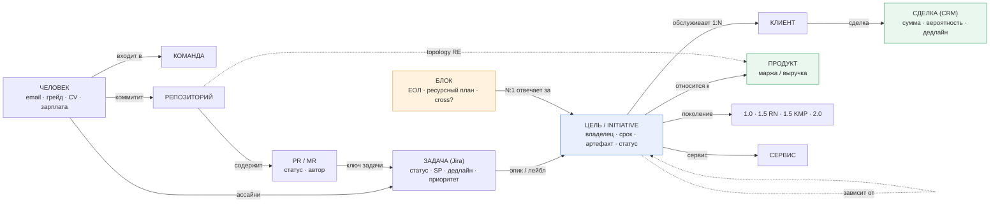
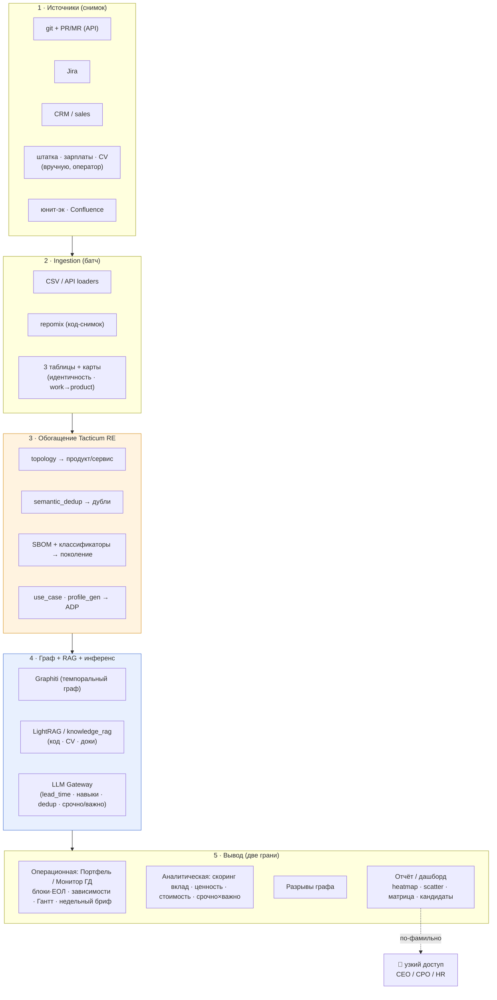

# IVA Control Tower — v0.2 (портфель инициатив + управленческая аналитика: команды, люди, ценность)

> **Продукт Tacticum: [Tacticum Helm](apps-helm.md)** (седьмое приложение экосистемы, [architecture.md §1.2](../../architecture.md)). «Control Tower» — рабочее/заказчиковое имя того же решения. Helm — **read-only executive-overlay**, не система записи: требования ведёт **Compass**, задачи/код — **Forge/Dev**, Helm их **читает** и навешивает executive-линзу (портфель · ценность · оптимизация штата). Границы — [apps-helm.md §4](apps-helm.md).
> **Уточнение «read-only»:** read-only — к **системам-источникам**. Собственное хранилище **управленческих аннотаций** (блоки/ЕОЛ, ручные зависимости, override статусов с обоснованием, оспоренный `lead_time`) Helm ведёт сам — это его данные, не дубль чужих.
>
> **Что это.** Control Tower / Helm — агентный управленческий слой поверх данных IVA (Jira · Confluence · git · CRM · sales pipeline · штатка · зарплаты · CV). Один граф `Signal → Initiative`, **две грани** над ним:
> - **Операционная — «Портфель / Монитор ГД» (запрос CEO):** прозрачное ведение всех инициатив — планы, зависимости, ответственные (ЕОЛ), сроки, еженедельный статус (§5). Отвечает на «*что делаем, кто ведёт, где заблокированы, что горит на этой неделе*».
> - **Аналитическая — «Ценность» (§6):** кто/какая команда создаёт ценность (деньги/развитие) vs занят «фигнёй», кого куда переключить — вплоть до **плана радикальной оптимизации штата** (переосмысление состава/загрузки + ADP).
>
> Обе грани — **один забор данных, один граф**; различаются линзой вывода.
> **Ключевой сдвиг v0.2:** первый результат — **MVP-снимок (повторяемый недельный батч, без RT/NRT)**. Волна 1 разбита: **1a «Монитор ГД»** (Jira + ручные входы → статичный HTML-отчёт; без карты идентичности и без обязательного LLM — первое демо CEO ≈2 недели) → **1b «Ценность»** (git/RE/CRM/HR → скоринг команд/ФИО). Субстрат — **темпоральный граф + graph-RAG с самого начала** (Graphiti + LightRAG + knowledge_rag). Половина код-аналитики уже есть в **Tacticum RE**.
> **Статус:** дизайн под MVP. Согласован с CEO-видением [«План А — RnD»](../../iva-synergy/data/). Предыдущая версия — [control-tower.md](control-tower.md).

---

## 1. Проблема (что болит в IVA сегодня)

**Управляемость и прозрачность:**
1. **Нет единой картины** — задачи/инциденты/релизы/клиенты/требования в 6-7 системах; «что горит / кто владелец / статус» собирают руками.
2. **Обратная связь не конвертируется** — 402 открытых FR, 205 старше года, 5 в работе.
3. **Разорвана цепочка Sale → Presale → Product → RnD** — требование теряется на стыках.
4. **Управление без «объектов управления»** — решения без владельца/срока/артефакта; нет журнала и ритма.
5. **Надёжность/инциденты не под контролем** — P1-resolve 14,5 дн против 5.
6. **Приоритеты плывут** — нет объективной приоритизации; **не видно, что срочно и важно**.
7. **Нет единого ответственного лидера (ЕОЛ) на блок** — ответственность размазана (особенно «все бэки»), CEO не с кем провести еженедельку по продукту.
8. **Зависимости и план не прозрачны** — «зависимость от бэков», «не сможет мерджить», пересечения версий видны только когда уже сорвано; нет план-графика с зависимостями.

**Люди и деньги:**
9. **Непрозрачно, кто создаёт ценность** — оценка по ощущениям/активности, а не по результату и деньгам.
10. **Ресурс уходит «на фигню»** — хорошие команды заняты не тем, что несёт деньги/развитие; нет карты «команда × ценность».
11. **Раздутый штат** — нет инструмента объективно переосмыслить состав/загрузку и радикально сократить (−100 FTE+), не потеряв знания.
12. **Дубли** — одинаковая функциональность в разных репо/командах (duplication-tax: 8 чатов, 5 почт).

> **Срез по треугольнику:** **Люди** — нет владельцев/ЕОЛ и объективной оценки ценности (7,9,10); **Процессы** — нет сквозного потока, зависимостей и ритма решений (2,3,4,6,8); **Инструменты** — нет единого пульта, всё размазано (1,5,12).

---

## 2. Цель

Единое место, где видно: **что важно и срочно · кто отвечает · кто/какая команда создаёт ценность · что делать**.
- **Операционная цель (CEO):** прозрачно вести **все инициативы** — план, зависимости, ответственный (ЕОЛ), срок, статус; проводить **еженедельный контроль** по блокам («Монитор ГД»).
- **Стратегическая цель:** **радикальная оптимизация штата** за счёт (а) переключения команд с низкоценного на приоритеты, (б) сворачивания «фигни», (в) ADP (−50% application FTE).

Всё — с человеком в цикле и защитой знаний.

---

## 3. Модель данных: Signal → Initiative

| Уровень | Что | Ключевое |
|---|---|---|
| **Signal** | Любое событие из системы: Jira-issue, git-commit/MR, CRM-сделка, mail/chat, monitoring-alert | `{source, external_id, type, severity, entity_refs, text, ts, url}` |
| **Initiative** (единица управления) | То, вокруг чего принимают решения; агрегирует Signals | владелец + срок + артефакт + доказательная база; класс: инцидент / дефект-FR / релиз / клиентское обязательство / фича / задача ПК |
| **Блок** (единица ответственности и контроля) | Управленческая группировка инициатив с **одним ЕОЛ** (≈ CEO-БЛОК 1–7: One, Почта, CS+Largo, Shared-функции…) | ЕОЛ (Accountable) + команда + ресурсный план; тег *основного* продукта+поколения; флаг **cross** для сквозных (напр. «все бэки») |

**Генезис Initiative (откуда она берётся, Волна 1).** Инициативы порождаются **только из трёх источников**: (а) **кураторская цель** (ручной вход), (б) **продажная инициатива** (см. ниже), (в) **Jira-эпик** (авто-кандидат). Одна и та же вещь, пришедшая разными путями (цель «ГОСТ-шифрование» + обязательство ЦБ + эпик MAIL-123), **связывается/мержится оператором** при сборке снимка (LLM-подсказки похожести — Волна 1b). Дальше Signals (задачи/коммиты/сделки) агрегируются на *существующие* Initiative через Т1–Т3; сами по себе новые Initiative из сигналов не рождаются — только из (а)–(в) или решением оператора/ЕОЛ. Это правило убирает дубли и двойной счёт.

**Продажная инициатива (SalesInitiative)** — эволюция «клиентского обязательства» (ревизия 2026-07-03): `title · client · product · generation · amount · probability · deadline (обещание клиенту) + expected_close (ожидаемое закрытие сделки) · stage (lead / переговоры / контракт / won / lost — мапится на стадии CRM) · owner (сейл) · comment · depends_on → Initiative[]`. **Новое ребро `SalesInitiative → зависит от → Initiative`**: продажа блокируется готовностью delivery-инициатив, светофор продажи наследует красноту блокеров. Ведётся в **UI Helm** (CRUD); CSV — импорт/сид; CRM-выгрузка позже — без смены модели.

**Три ортогональные оси + рабочая единица** (см. примеры связок ниже):

| Ось | Смысл (зачем) | Пример значений |
|---|---|---|
| **Блок** | *Кто ведёт* (1 ЕОЛ), единица еженедельного контроля + ресурсный план | БЛОК 1..7, Shared-функции, «CS+Largo» |
| **Продукт** | *Что продаём* — маржа/выручка, юнит-эк | One, Mail, MCU, CS, Largo |
| **Поколение платформы** | *На какой технологии* — долг/миграция | 1.0 · 1.5 RN · 1.5 KMP · 2.0 · 3.0 |
| **Initiative** | Единица работы/решения на пересечении; катится в блок | релиз / инцидент / клиентское обязательство / фича |

**Блок ≠ продукт ≠ поколение:** блок — *свободная управленческая группировка вокруг ЕОЛ*, не производная от продукта/поколения. Shared-блок сквозной (все бэки → и One, и Mail); один продукт → несколько блоков (One 1.0 RUN vs One 2.0 — разные ЕОЛ); блок-спецпроект (CS+Largo под цель). У каждого блока — *основной* продукт+поколение для роллапа; сквозные помечены `cross`.

**Измерения Initiative (граф):**
- принадлежит **Блоку (N:1)** → **ЕОЛ** · обслуживает **Клиента (1:N)** · относится к **Продукту** (Mail / MCU / CS / One / …) · на **Поколении платформы** (**1.0** · **1.5 RN** · **1.5 KMP** · [2.0]) · [→ **Сервис** внутри платформы].
- **Зависимости:** `Initiative → зависит от → Initiative / Блок / Сервис` (блокеры, «ждём бэк», пересечения версий). Засев: Jira-линки `blocks/is blocked by` + RE-topology (репа A→B ⇒ подсказка) + ручной ввод ЕОЛ (§5).
- **Граф:** `Человек → Команда → работает на → Initiative`; `Initiative → Клиент → сделка/пайплайн (CRM: сумма, дедлайн)`; `Продукт → маржа/выручка (юнит-эк)`.
- **Сквозная цепочка:** `Человек → Репозиторий → Задача (Jira) → Цель → Обещание клиенту (CRM)`. **Разрывы этой цепочки — главный инсайт** (§6.1): цель без работы, работа без цели, работа без денег/клиента.
- Control Tower держит **граф ссылок + нормализованные объекты**; детали живут в источнике.

**Примеры связок (Блок → Initiative → Продукт → Поколение → Клиент):**

| Блок (ЕОЛ) | Initiative (класс) | Продукт | Поколение | Клиент | Почему так |
|---|---|---|---|---|---|
| One (Зализняк) | «ONE 1.5 без багов к разбору» *(клиент. обязательство)* | One | 1.5 RN | Иннопрактика | блок = продукт+поколение (обычный случай) |
| Почта (Монахов) | «ГОСТ-шифрование, план проекта» *(клиент. обязательство)* | Mail | 1.0 **+ часть 2.0** | ЦБ | инициатива на 2 поколениях («что 1.5 / что 2.0») |
| **Shared-бэки** (1 ЕОЛ) | «Авторизация / захардкод доменов / бомбит запросами» *(дефект-FR)* | **One + Mail** `cross` | 1.0→1.5 | внутр. enable | блок сквозной по продуктам |
| Тех-трансформация (СТО) | «RN-федерация, вынести общие фронты» *(задел)* | сквозной | 1.5 RN → 2.0 | внутр. задел | блок идёт по поколению |
| CS+Largo (Журавлев/Сухов) | «CS: ADP-плюшки + сертификация СОРМ» *(релиз)* | CS, Largo | 1.0 | Сотел/Флет/Искра | блок = спецпроект под цель |

> Это стандартный паттерн **Software Engineering Intelligence** (Oobeya, Waydev, Typo, Allstacks, DX, EvolveDev): commit → PR → Jira → цель, метрики по командам без ручного ввода. Наше отличие — привязка к **деньгам/клиентам (CRM)**, **ценности-vs-стоимости (зарплаты/CV)** и **суверенный контур** (Gateway/локальный инференс).

### 3.1. Модель данных — граф

**Три таблицы соответствий сшивают цепочку:** Т1 `коммит→задача` · Т2 `задача→цель` · Т3 `цель→обещание(клиент)`. **Разрывы** в этих связях = §6.1. **Оси оценки** навешиваются на узлы: срочность/важность — на Initiative; вклад/стоимость — на Человека; ценность/загрузка — на Команду; ответственность/статус блока — на **ЕОЛ**.

---

## 4. Срочно × Важно (приоритизация — с Волны 1)

- **Срочно** = `дедлайн(мин по клиентам/обязательствам) − lead_time ≤ 2 месяца` от «сейчас». **`lead_time` (разработка + внедрение): ввод ЕОЛ первичен, LLM даёт черновик-подсказку** (по описанию/скоупу Initiative; помечен confidence, оспариваем). Светофор и матрица обязаны работать **и без LLM** (по ЕОЛ-вводу/просрочке) — LLM не в критическом пути Волны 1a. Калибровка LLM-оценки по историческим циклам Jira — Волна 2.
- **Важно** = `Σ (сумма сделки × вероятность стадии CRM)` по привязанным клиентам Initiative (+ отдельно показываем **полную** сумму без взвешивания).
- **Матрица:** срочно+важно (делать сейчас) · важно-не-срочно (план) · срочно-не-важно (делегировать / ADP) · ни то (стоп).
- Считаем **на уровне Initiative**, агрегируем на **команду/ФИО** (нагрузка срочным, доля важного).

---

## 5. Портфель / Монитор ГД (операционная грань — запрос CEO)

Прозрачное ведение **всех инициатив**: планы · зависимости · ответственные (ЕОЛ) · сроки · статус. Это вторая линза над тем же графом (§3), а не отдельный продукт.

### 5.1. Что показывает

- **Дерево ответственности:** `Блок → ЕОЛ → инициативы под ним` (≈ CEO-БЛОКи 1–7). У каждого блока — один ЕОЛ (Accountable), у инициативы — владелец (Responsible).
- **Статус-светофор** на инициативе/блоке: 🟢 в графике · 🟡 риск · 🔴 сорвано. Считается автоматом (план-финиш vs сегодня + наличие блокеров), ЕОЛ может переставить **с обоснованием** (аудитируемо).
- **Зависимости** (`Initiative → зависит от → Initiative/Блок/Сервис`) — граф блокеров + подсветка «заблокировано»; на Гантте — критический путь (с Волны 3).
- **План-график (Гантт):** дорожки переключаемые — по **блокам** (дефолт), по **трекам** (FE/BE/Комиты/Процессы — слайд 5 CEO; *трек — опциональный ручной атрибут блока/инициативы*), по продуктам, по поколениям. Вехи — ручные + клиентские (пилот/прод).
- **Продажные инициативы (Sales):** живой срез `клиент × продукт × требование × срок × сумма × стадия` (SalesInitiative, §3); питает дедлайн (§5.3) и важность (§4); зависимости sales→delivery подсвечивают, какие продажи заблокированы разработкой.
- **Интерактивность дэша (ревизия 2026-07-03):** live-дэш веб-аппа — фильтры (блок/продукт/поколение/статус/заблокированные), переключаемые дорожки Гантта, drill-down инициативы (источники генезиса, зависимости, история override), inline-действия ЕОЛ (override с обоснованием, зависимости), **drag-n-drop на Гантте двигает только `plan_finish` (план ЕОЛ, аудируемо)** — `deadline` меняется только через продажную инициативу; live-обновления по SSE.

### 5.2. Сроки и статус (откуда даты)

- **дедлайн** = мин. по клиентским обязательствам (Sale-список / CRM) — целевой срок;
- **план-финиш** = `дедлайн − lead_time` (§4: ЕОЛ-ввод первичен, LLM — черновик);
- **факт-статус** = светофор автоматом + override ЕОЛ с обоснованием;
- принцип: план **считается из данных**, ЕОЛ *подтверждает/оспаривает*, а не ведёт вручную ещё один трекер.

### 5.3. «Монитор ГД» — еженедельный артефакт

К еженедельной встрече CEO по блоку Control Tower генерит **бриф из графа** (LLM через Gateway):

- **статус-светофор** блока и его инициатив;
- **что изменилось за неделю** — diff со снимком прошлой недели (новые/закрытые/сдвинутые/заблокированные);
- **топ-блокеры и зависимости** — что кого держит;
- **дедлайны ≤ 2–4 нед** и **срочно × важно** (§4);
- **решения на CEO** — где нужен вердикт/ресурс.

ЕОЛ дополняет/оспаривает бриф перед встречей. Это **decision-support, не вердикт**.

**Режим снимков (ревизия 2026-07-03: live-БД + явная фиксация).** Данные живут в БД веб-аппа и меняются непрерывно (UI). Дэш показывает **live**-состояние; «снимок» — **явно зафиксированный слепок** (кнопка «Зафиксировать снимок недели» / CLI `helm snapshot commit`; каждый — `snapshot_id` + дата, аудируемое событие). Diff «что изменилось за неделю» и недельный бриф считаются **между двумя последними зафиксированными** снимками. Фиксирует оператор перед еженедельками (или по крону). Волна 2 добавляет только **авто**-рефреш коннекторами; RT не требуется. Бриф Волны 1a — детерминированный шаблон (изменения/блокеры/дедлайны списками); LLM-проза подключается, как только доступен Gateway, и не блокирует демо.

### 5.4. Зависимости — засев (3 источника)

1. **Jira-линки** `blocks / is blocked by` — тянем автоматом, где проставлены;
2. **RE code-topology** — репа A зависит от репы B (SCIP/импорты) ⇒ *подсказка* зависимости между инициативами на этих репах (человек подтверждает) — закрывает «зависимость от бэков»;
3. **ручной ввод ЕОЛ** на еженедельке — то, что не выводится из данных («ждём бэк», «не сможет мерджить»).

> Волновая раскладка операционной грани — §9 (в основном **Волна 1**: блоки/ЕОЛ, ручной Sale-список, Jira+ручные зависимости, недельный бриф, Гантт по блокам; RE-topology-зависимости и критический путь — Волны 2–3).

---

## 6. Ценность команд и людей (3 среза MVP)

### 6.1. Разрывы графа (главный инсайт)

Строим граф `Человек → Репо → Задача → Цель → Обещание клиенту` и ищем **разрывы** — это и есть картина «кто чем занят и зачем»:
- **Цель без работы** — приоритет/обещание есть, работы под него нет (риск срыва).
- **Работа без цели** — коммитят/делают задачи, не привязанные ни к одной цели → кандидат на «фигню».
- **Работа без денег/клиента** — цель есть, но за ней нет пайплайна/обязательства → низкая ценность.
- **Обещание без работы** — клиенту обещали, в Jira/git тишина → срочный риск.
- **Срочно+важно без владельца/ресурса** — горит, но никто не назначен.
- **Дубли** — разные команды делают одно и то же (semantic_dedup).

### 6.2. Индикаторы (по снимку)

*По человеку (ФИО):*
- **Вклад-скор** = закрытые Jira-issue (взвес по SP/типу) + MR/commits (взвес по объёму/критичности репо, из repomix/SCIP; сгенерённый код отфильтрован).
- **Ценность работы** = вклад × приоритет продукта (деньги/маржа) × важность Initiative.
- **Стоимость** = зарплата (по человеку).
- **Квадрант «вклад-ценность × стоимость»:** звезда · ценный · переоценённый · недозагруженный.
- **Fit по CV** = навыки/грейд/опыт vs текущая работа → over/under-qualified, потенциал переключения.

*По команде:*
- **Команда × ценность приоритета** → «на деньгах/развитии» · «на фигне» · «боттлнек».
- **Загрузка** = WIP/throughput; **дубли** (semantic_dedup из RE — одинаковая функциональность в разных репо).
- **ADP-замещаемость** = доля работы, автоматизируемая agentic-конвейером.

**Выход MVP (3 среза):**
1. **Ценность работы** — heatmap «команда × ценность приоритета» (× срочно/важно).
2. **Вклад-vs-стоимость** — scatter «человек: вклад-ценность vs зарплата» (квадранты).
3. **Реассайнмент/сокращение** — топ-кандидаты: хорошая команда на низкоценном → переключить; переоценённый/недозагруженный/низкоценное направление/ADP-замещаемое → оптимизировать.

> ⚠ Скоры — **поддержка решения (proxy), не приговор**: объяснимость и оспариваемость обязательны; кадровые решения — человек + HR/юр (см. §10).

---

## 7. Данные для MVP (снимок)

| Источник | Что берём | Для чего |
|---|---|---|
| **Штатка** | ФИО, команда/подразделение, роль/грейд, руководитель, статус | основа: «человек» и «команда» |
| **Зарплаты** | оклад/ФОТ **по человеку** | стоимость |
| **CV** | навыки/стек, грейд/сеньорити, опыт (лет), роли | профиль, ценность, fit |
| **Jira** | issue: assignee, статус, тип, проект/продукт, оценка/SP, даты, спринт, **приоритет/дедлайн** | вклад + срочность + продукт |
| **git + repomix** | commit/MR (author, repo, объём) + код-снимок (стек/структура/дубли) | инженерный вклад, work→product, дубли |
| **CRM + sales pipeline** | сделки/пайплайн по клиентам/продуктам: **сумма, вероятность стадии, дедлайн** | важность + срочность |
| **Юнит-экономика/маржа по продуктам** (data room) | прибыльность/приоритет продукта | «деньги vs фигня» |
| **Confluence** | доки/решения (адаптер `docs/confluence_api` из RE) | контекст |

**Как связываем — 3 таблицы соответствий** (метод из [idea.md](idea.md)):
1. **Т1 коммит → задача** — по ключам задач в сообщениях/ветках/PR. **PR/MR (заголовок/автор/статус/дата) — через API** (в git-логе их нет).
2. **Т2 задача → цель** — по **эпикам/лейблам** Jira (критичны; где нет — LLM-догадка, помечена как менее точная).
3. **Т3 цель → обещание клиенту** — **sales pipeline** (что / кому / к какой дате → дедлайны).

Плюс две сшивающие карты: **идентичность** (email ↔ ФИО ↔ штатка ↔ CV ↔ зарплата) и **work→product/сервис/поколение** (из RE-topology + доуточнение). На MVP карты полуручные — это ок (батч).

**Входы только с оператором (ручные) — с ревизии 2026-07-03 ведутся в UI веб-аппа (CRUD); CSV — импорт/сид:**
1. **Список целей** — что есть и что критично (модель сама не выведет).
2. **Состав команд** — если есть, отлично; иначе — черновик из данных (кто в какие репо коммитит, кто на каких проектах в Jira).
3. **Блоки и ЕОЛ** — управленческая нарезка (БЛОК 1–7 + Shared/спецпроекты), для каждого — ЕОЛ и основной продукт/поколение (+флаг `cross`). Это кураторский вход CEO/CPO (§5.1).
4. **Продажные инициативы** (§3, бывший Sale-список) — CRUD в UI; позже выгрузка из CRM без смены модели.
5. **Аннотации ЕОЛ** — override светофора (с обоснованием), ручные зависимости, подтверждение merge-кандидатов генезиса — живые еженедельные действия, тоже в UI.
6. **Справочники** product/generation — ведение в UI (S8, в Волне 1a).

**Чувствительное (зарплаты/CV/идентичность) на MVP — оператор готовит и загружает вручную** (не авто-коннектор к HR/payroll). Формат по умолчанию — **плоские CSV** по каждому источнику. Остальной инференс — через LLM Gateway.

---

## 8. Архитектура и переиспользование (не строим с нуля)

### 8.1. Архитектура решения — компоненты и поток

Оранжевый — **готовое из Tacticum RE**; синий — **платформенный флот**; чувствительный «красный» контур — узкий доступ.

### 8.2. Субстрат (с Волны 1, всё сразу)
- **Graphiti** — темпоральный граф знаний (узлы/связи + время → velocity, устаревание, дрейф приоритетов). Уже под platform `memory`.
- **LightRAG** — graph-RAG поверх (dual-level retrieval).
- **knowledge_rag** (Qdrant + Meili) / **chroma** — RAG по неструктурному (CV, Confluence, чаты).
- **LLM Gateway** — весь инференс (lead_time-оценка, парс навыков CV, dedup-judge, скоринг); суверенная маршрутизация.

**Из Tacticum RE (KB-Brownfield-Bootstrap) — берём готовое:**

| Компонент RE | Что даёт |
|---|---|
| **topology** (`topology`, `serena_topology`, `topology_grouping`, `topology_profiles`) | Карта **репо/модуль → продукт → сервис** = ключ work→product + **уровень сервисов** |
| **snapshot/repomix · vcs/git_local · code_index (SCIP/serena)** | Вклад на уровне кода (авторство, symbol-ownership) |
| **semantic_dedup** | Дубли функциональности → duplication-tax по командам/продуктам |
| **sbom/syft + классификаторы** (component/module/container/generated) | Стек → **поколение платформы (1.0/1.5 RN/1.5 KMP)**; отсечение сгенерённого кода |
| **use_case / business_scenarios / uc_metrics** | Бизнес-сценарии → привязка работы к ценности |
| **behaviour + adr** | Что делает модуль + решения → контекст |
| **docs/confluence_api+html** | Коннектор Confluence |
| **phases + phase_cache** (incremental pipeline) | Паттерн батч-пайплайна со снимком/кэшом = наш MVP-режим |
| **profile_gen** | Оценка ADP-замещаемости |
| **kbconsole** (web) | Паттерн UI для дашборда/ревью |

---

## 9. План по волнам (MVP-first)

Обе грани делят один граф и один забор данных. **Операционная грань (Монитор ГД) идёт первой** (CEO нужен контроль сразу) — Волна 1 разбита на **1a** (быстрое демо, без рисковых зависимостей) и **1b** (ценность); тяжёлая автоматика догружается в Волнах 2–3.

| Волна | Что | Выход + DoD |
|---|---|---|
| **1a — Монитор ГД (веб-апп)** | **Jira (CSV/JQL) + все ручные входы в UI** (цели · блоки/ЕОЛ · команды · справочники · продажные инициативы · аннотации ЕОЛ). Генезис Initiative (цель∪продажная инициатива∪эпик, merge оператором). Светофор по ЕОЛ-вводу/просрочке (**LLM не в критическом пути**), срочно×важно-lite. **Без git/RE/CRM-выгрузки/HR — и без карты идентичности (риск №1 не блокирует)** | **Интерактивный веб-апп** (FastAPI+Jinja/HTMX+Postgres+Alembic, **OIDC project-hub**): live-дэш (фильтры · переключаемый Гантт · drill-down · inline ЕОЛ-действия · drag `plan_finish` · SSE) + CRUD всех входов + **фиксация снимка** (кнопка/CLI) → diff между снимками; **статичный HTML и markdown-бриф — экспорт** («отчёт недели»). **DoD-демо:** CEO открывает дэш блока → видит инициативы/статусы/блокеры, вносит продажную инициативу, фиксирует снимок → недельный бриф с diff и «решениями на CEO» |
| **1b — Ценность (команды × ФИО)** | + git+PR/MR + repomix + **RE-обогащение** (topology/dedup/sbom/profile_gen) + CRM/sales + штатка/зарплаты/CV (вручную, 🔴) + **карта идентичности** + Т1–Т3 → полный граф; LLM-скоринг (lead_time-черновик, навыки CV, dedup-judge) | **Дашборд-аналитика:** heatmap «команда × ценность», scatter «вклад vs стоимость», матрица срочно×важно (полная), разрывы, топ-кандидаты. **DoD-демо:** по блоку виден срез «кто на деньгах / кто на фигне» с объяснимостью каждого скора до первички |
| **2 — Регулярный рефреш + автоматика** | Коннекторы (read) для периодического обновления снимка; нормализация Signal→Initiative; **RE-topology-подсказки зависимостей**; срочно×важно автоматом; ценностная аналитика команд/людей углубляется; guardrail для чувствительного | Обновляемая аналитика + управляемый kanban |
| **3 — Оперативные инсайты + критический путь + ритм ПК** | Агенты-инсайтеры (dedup / priority / release-risk / hot-customer / digest); **критический путь на Гантте**; CRM-коннектор (обязательства автоматом); авто-кандидаты (мониторинг→инцидент, поддержка→FR); NRT/RT | Прозрачность/приоритеты в реальном ритме |
| **4 — Write-back + углубление + Forge** | Точечный write-back (с человеком); углубление team-value/реассайнмента; продуктизация Forge | Снятие рутины + внешний SKU |

### 9.1. Пошаговый алгоритм подготовки MVP (готовка Волны 1)

> **Маппинг на волны:** **1a** = Шаг 0 + Шаг 1 (только Jira) + Шаг 2-lite (генезис/связывание инициатив, без Т1/Т3 и карты идентичности) + Шаг 4-lite (граф без git/HR) + Шаги 7–8 (Монитор ГД, HTML) + Шаг 9. **1b** = полные Шаги 1–9. Каждый прогон — `snapshot_id` + diff (§5.3).

**Шаг 0 — входы с оператором.** Согласовать список **целей** (что есть/критично) + черновик **состава команд** (или собрать из данных) + **блоки и ЕОЛ** (управленческая нарезка, основной продукт/поколение, флаг `cross`) + **кураторский Sale-список обязательств** (`клиент × продукт × требование × срок × сумма × вероятность`). Подготовить **чувствительное вручную** (штатка, зарплаты по ФИО, CV) в CSV.

**Шаг 1 — снимок сырья (CSV / API):**
- **git:** по коммиту — хеш, репо, автор-email, дата, сообщение, ветка; **PR/MR через API** — заголовок, автор, статус (merged?), дата; **repomix** по репам (код-снимок).
- **Jira:** по задаче — ключ, статус, ассайни, эпик/родитель, лейблы, даты (постановки/дедлайн), приоритет.
- **CRM / sales:** обещание — клиент, продукт, сумма, вероятность стадии, дедлайн.
- **Юнит-эк / маржа по продуктам** (из data room); **Confluence** (опц.).

**Шаг 2 — три таблицы + сшивающие карты:**
- Т1 коммит→задача (ключи из сообщений/веток/PR); Т2 задача→цель (эпики/лейблы; иначе LLM, помечено); Т3 цель→обещание (sales).
- Карта идентичности (email ↔ ФИО ↔ штатка ↔ CV ↔ зарплата); карта work→product/сервис/поколение (из RE-topology).

**Шаг 3 — обогащение Tacticum RE:** прогнать репо через RE — **topology** (репо→продукт/сервис), **SBOM+классификаторы** (поколение 1.0/1.5 RN/1.5 KMP), **semantic_dedup** (дубли), **use_case** (сценарии), **profile_gen** (ADP-замещаемость).

**Шаг 4 — граф:** узлы (человек/команда/репо/задача/цель/**блок**/клиент/продукт/сервис/поколение) + связи из 3 таблиц + `блок→ЕОЛ→инициатива` + **зависимости** (Jira-линки + ручные) → в **Graphiti**; код (repomix) + CV/Confluence → в **LightRAG/knowledge_rag**.

**Шаг 5 — LLM через Gateway:** оценка `lead_time` по Initiative; парс навыков из CV; dedup-judge; классификация срочно/важно.

**Шаг 6 — расчёт осей:** срочно×важно (Initiative); вклад/ценность/стоимость/квадрант (ФИО); команда×ценность/загрузка/дубли/ADP-замещаемость.

**Шаг 7 — разрывы + статус:** пройти граф → цель без работы · работа без цели · работа без денег · обещание без работы · срочно+важно без владельца · дубли (§6.1). Посчитать **статус-светофор** инициатив/блоков (план-финиш vs сегодня + блокеры) и **план-финиш** = `дедлайн − lead_time`.

**Шаг 8 — вывод (две грани):**
- **Монитор ГД (операционная):** дерево `блок→ЕОЛ→инициативы` со статусами, граф зависимостей, Гантт по блокам, **недельный бриф на блок** (статус + diff недели + блокеры + дедлайны + решения на CEO).
- **Аналитика (ценность):** heatmap «команда × ценность» · scatter «человек: вклад × стоимость» · матрица «срочно × важно» · список разрывов · топ-кандидаты (реассайнмент / оптимизация).
- «Красный» контур (по-фамильно) — узкий доступ.

**Шаг 9 — ревью с человеком:** ЕОЛ оспаривает статусы/зависимости брифа; оспаривание скоров, KT-gate перед решениями.

**Итог Волны 1:** (1) **Монитор ГД** — прозрачный срез всех инициатив (план · зависимости · ЕОЛ · статус) + недельный бриф на еженедельку CEO; (2) статичный отчёт-аналитика, отвечающий «что важно и срочно · кто ценен · какая команда на деньгах / на фигне · кого куда переключить».

---

## 10. Governance (чувствительные данные, зона людей)

- **MVP:** зарплаты/CV/идентичность **готовит и загружает оператор вручную** (доверенный круг); никаких авто-коннекторов к HR/payroll. Остальной инференс — **через LLM Gateway** (суверенно).
- **Два контура доступа:** «зелёный» (команда × ценность, загрузка, дубли — шире) и «красный» (по-фамильно вклад/стоимость/кандидаты — узкий круг: CEO/CPO/HR).
- **Скор = поддержка решения, не приговор:** объяснимость (из чего собран вклад/ценность), оспариваемость.
- **Knowledge-capture gate:** никто не уходит, пока домен не покрыт в KB/профиле (знания раньше сокращений).
- **Кадровые решения** — человек + HR/юр; агент не «увольняет».

---

## 11. Метрики MVP

- **Управленческие:** release success, P1 time-to-resolve (14,5→5 дн), конверсия FR (402/5), доля Initiatives срочно+важно без владельца.
- **Операционные (Монитор ГД):** доля инициатив со статусом-светофором и ЕОЛ, доля 🔴/🟡, число заблокированных инициатив и средняя длительность блокировки, % блоков с проведённой еженеделькой.
- **Ценность/деньги:** доля работы команды на приоритете (деньги/развитие), value-for-money по ФИО, duplication-tax, ADP-замещаемая доля.
- **Оси:** клиент × продукт × поколение платформы (× сервис).

---

## 12. Открытые вопросы

0. **Блоки ↔ ЕОЛ** — финальная нарезка блоков и назначение ЕОЛ (кто Accountable за «все бэки», Shared, спецпроекты) — кураторское решение CEO/CPO; без него дерево ответственности пустое.
1. **Карта идентичности** — общий email во всех системах? Иначе собираем полуручную (риск №1).
2. **CRM: вероятность стадии** — есть ли поле вероятности/стадии для взвешивания важности.
3. **`lead_time` LLM** — на каких данных оцениваем (описание Initiative + historical velocity команды); калибровка.
4. **Поколения платформ** — точное сопоставление репо → 1.0 / 1.5 RN / 1.5 KMP (из SBOM/topology + доуточнение).
5. **UI дашборда** — ✅ решено (ревизия 2026-07-03): **интерактивный веб-апп** FastAPI+Jinja/HTMX+Postgres, OIDC project-hub, vendored gantt-JS + SSE; JSON-эндпоинты сразу (дорожка к React в 1b+); статичный HTML/бриф — экспорт.
6. **Глубина до сервисов** — на MVP до продукта, или сразу до сервисов внутри платформ.
7. **Хостинг чувствительного снимка** — где физически живёт MVP-снимок с зарплатами/CV: периметр IVA (on-prem, как целевое по ADR-0009) vs наш контур на время MVP (оператор готовит данные сам). Надо решить до Волны 1b. *Рабочее допущение 1a (следствие OIDC project-hub): апп хостится на нашем контуре, где хаб достижим; зарплат/CV в 1a ещё нет.*
8. **Видимость Sale-сумм** — суммы/вероятности сделок — коммерчески чувствительное: видят ли их ЕОЛ в Мониторе ГД, или только CEO/CPO (сейчас контуры покрывают только HR-данные).

---

## 13. Данные: что и у кого запросить (детализация)

| # | Источник / данные | Что конкретно (поля / выгрузка) | У кого запросить | Формат / доступ | Чувствит. |
|---|---|---|---|---|---|
| 1 | **git (GitHub/GitLab)** — коммиты | по коммиту: хеш, репо, **author-email**, дата, сообщение, ветка | админ git / DevOps / Change-Enablement Lead (под CTO) | read-token к API **или** CSV-выгрузка | низкая |
| 2 | **git — PR/MR** | заголовок, автор, статус (merged/open), дата, ключи задач | тот же | **только API** (в git-логе PR нет) | низкая |
| 3 | **git — доступ к репам** | клон/зеркало для **repomix** и SCIP | тот же | read-доступ к репам (P0-список) | низкая |
| 4 | **Jira** | по задаче: ключ, статус, **ассайни**, **эпик/родитель**, **лейблы**, тип, оценка/SP, даты (постановки/дедлайн), **приоритет**, проект | Jira-админ / продуктовый офис (PMO) | CSV/JQL-export **или** API read | низкая |
| 5 | **CRM + sales pipeline** | по сделке: **клиент**, продукт, **сумма**, **вероятность стадии**, **дедлайн**, что обещали | Коммерческий блок / Sales Ops | CSV-export | ⚠ коммерч. |
| 6 | **Штатка** | ФИО, команда/подразделение, роль/грейд, руководитель, статус | Служба персонала (HR) | CSV | ⚠ ПДн |
| 7 | **Зарплаты** | оклад/ФОТ **по ФИО** | HR / C&B (финблок) | CSV — **оператор готовит вручную** | 🔴 высокая |
| 8 | **CV специалистов** | навыки/стек, грейд/сеньорити, опыт (лет), роли | HR / рекрутинг | файлы/CSV — **вручную** | ⚠ ПДн |
| 9 | **Юнит-экономика / маржа по продуктам** | прибыльность/выручка по продуктам (есть в data room: «37 млн анализ», отчёт о маржинальности) | Финблок / продуктовая экономика | xlsx | ⚠ финанс. |
| 10 | **Confluence** (опц.) | доки/решения (контекст) | Confluence-админ | API/export | низкая |
| 11 | **Цели** *(ручной вход)* | список целей/приоритетов: что есть, что критично | **CEO / CPO** | список | — |
| 12 | **Состав команд** *(ручной вход)* | человек → команда → проект/репо (если нет — соберём черновик из п.1,4) | тимлиды / CPO / HR | таблица | — |
| 13 | **Карта идентичности** | единый **email** человека во всех системах (Jira/git/HR) | ИТ / IdP-админ (IVA ID / project-hub) | справочник email↔ФИО | ⚠ ПДн |
| 14 | **Блоки и ЕОЛ** *(ручной вход)* | нарезка блоков (БЛОК 1–7 + Shared/спецпроекты), ЕОЛ на блок, основной продукт/поколение, флаг `cross` | **CEO / CPO** | таблица | — |
| 15 | **Кураторский Sale-список обязательств** *(ручной вход)* | `клиент × продукт × требование × срок × сумма × вероятность` (срез ≈ слайд 4) | **CEO / Sales Ops** | таблица/CSV | ⚠ коммерч. |

**Порядок запроса (минимальный набор, чтобы поехать):** сначала **1-4 + 11-14** (git+Jira+цели+состав+идентичность+**блоки/ЕОЛ** — даёт граф, дерево ответственности и разрывы), затем **5, 9, 15** (CRM+маржа+**Sale-обязательства** — даёт «важно/деньги» и дедлайны для Гантта), затем **6-8** (штатка/зарплаты/CV — даёт «стоимость/ценность по ФИО», готовит оператор).

**Права:** везде **read-only**; чувствительное (7,8,+ по-фамильные срезы) — узкий «красный» контур (CEO/CPO/HR), инференс через Gateway/локально.

---

*Дизайн MVP. Одна платформа — две грани над графом `Signal → Initiative`: операционная «Портфель / Монитор ГД» (запрос CEO: инициативы · зависимости · ЕОЛ · Гантт · недельный бриф) и аналитическая «Ценность» (команды/ФИО: ценность/стоимость/срочно×важно). Переиспользует Tacticum RE (topology/dedup/scip/sbom/use-cases/confluence/repomix/phase-cache) + платформенный флот (Graphiti/knowledge_rag/LLM Gateway). Цель Волны 1 — обе грани за снимок, с человеком в цикле.*