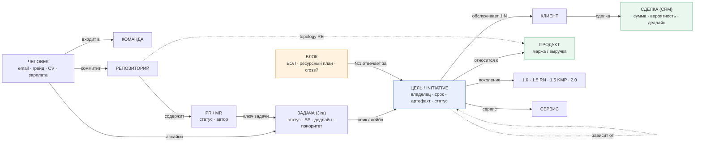
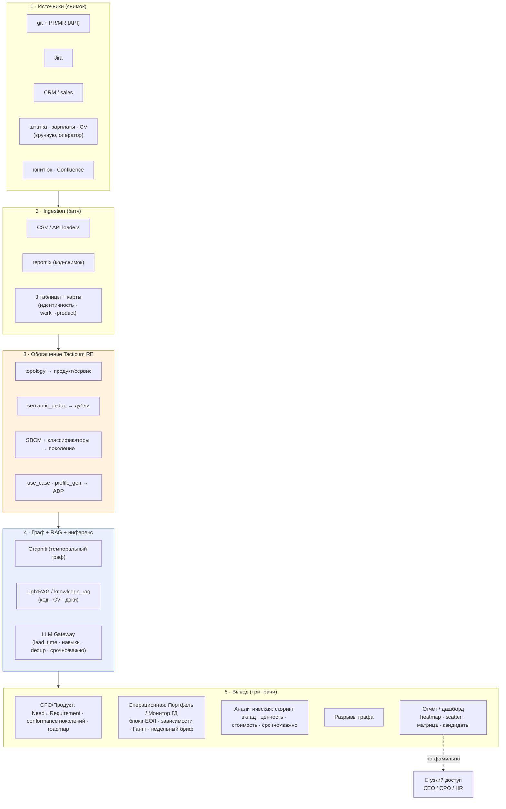
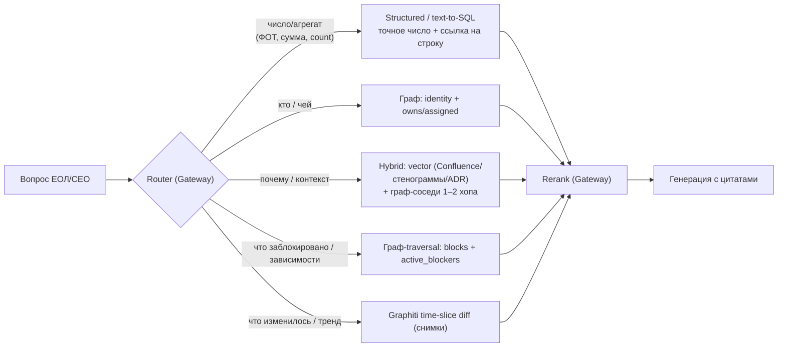

# IVA Control Tower — v0.3 (пульт топ-менеджмента: требования·поколения → инициативы → исполнение → ценность)

> **Продукт Tacticum: [Tacticum Helm](apps-helm.md)** ([architecture.md §1.2](../../architecture.md), 6 приложений). «Control Tower» — рабочее/заказчиковое имя. Helm — **App для топ-менеджмента для полноценного управления компанией**: один пульт C-уровня, проходящий весь цикл «болит/деньги → фичи (×поколение) → инициативы/блоки → ЕОЛ → исполнение → ценность/штат». **Read-only к системам-источникам** (Jira/git/CRM/SD/Forge/Dev-RE), но по **требованиям — система записи** (поглотил **Compass**, [platform ADR-0010](../../../../platform/docs/adr/0010-merge-compass-into-helm-product-lifecycle.md)). Границы — [apps-helm.md §4](apps-helm.md).
> **Уточнение «read-only»:** read-only — к системам-источникам. Собственные данные Helm ведёт сам: **требования** (Need↔Requirement, грань CPO/Продукт) + **управленческие аннотации** (блоки/ЕОЛ, ручные зависимости, override статусов с обоснованием, оспоренный `lead_time`).
>
> **Что это.** Control Tower / Helm — агентный управленческий слой поверх данных IVA (Jira · Confluence · git · CRM · sales pipeline · ServiceDesk · штатка · зарплаты · CV). Один граф `Signal → Need ↔ Requirement → Initiative`, **три грани** над ним (один забор данных, различаются линзой вывода):
> - **CPO / Продукт (§5A) — «что строить и почему»:** воронка `сигнал → Need → Requirement/Фича (×поколение)` + **conformance поколений** (закрываем ли требования 1.5, RN vs KMP). Отвечает CPO на «*что болит и приносит деньги · что войдёт в поколение N · где мы по текущему поколению*».
> - **Портфель / Монитор ГД (§5) — запрос CEO:** прозрачное ведение всех инициатив — планы, зависимости, ответственные (ЕОЛ), сроки, еженедельный статус. «*что делаем, кто ведёт, где заблокированы, что горит на этой неделе*».
> - **Ценность (§6):** кто/какая команда создаёт ценность (деньги/развитие) vs занят «фигнёй», кого куда переключить — вплоть до **плана радикальной оптимизации штата** (переосмысление состава/загрузки + ADP).
>
> **Ключевой сдвиг v0.3 (grill 2026-07-04):** Helm поглощает Compass и становится **единым App полного продуктового жизненного цикла для топ-менеджмента** (ADR-0010, supersede ADR-0008). Добавлена **третья грань CPO/Продукт** — двухуровневая модель Need↔Requirement + ось поколений; первый её срез — **conformance 1.5 RN vs KMP (G1 LLM)** под живую ставку План А/Б. «Потом разделим» обратимо (requirements-грань = выносимый bounded-context на Platform-субстрате).
> **Наследие v0.2:** первый результат — **MVP-снимок** (повторяемый недельный батч, без RT/NRT). Волна 1: **1a «Монитор ГД»** → **1b «Ценность»**; параллельный **трек C** (CPO/Продукт): **C1 conformance 1.5** → C2 demand-движок → C3 forward planning → C4 outcome (§9). Субстрат — темпоральный граф + graph-RAG (Graphiti + LightRAG + knowledge_rag); половина код-аналитики уже в **Tacticum RE**.
> **Статус (2026-07-04):** дизайн под MVP + старт реализации Волны 1a + трек C. Согласован с CEO-видением [«План А — RnD»](../../iva-synergy/data/). Предыдущая версия — [control-tower-v02.md](control-tower-v02.md).
> - **Код (репо `helm`):** домен + application + interface T0-tracer «Монитор ГД» готовы по TDD (генезис Initiative → светофор без LLM → diff снимков → HTML + недельный бриф; 57 тестов, ruff/mypy clean).
> - **T0 прогнан на реальном срезе:** поручения ГД (RnD 02.07) нормализованы в [`task management/statuses/ceo_directives.csv`](data/task%20management/statuses/) (owner_email **верифицированы по карте идентичности**) → 15 инициатив (🔴 2 · 🟡 13) → [Монитор ГД HTML + бриф](data/task%20management/statuses/). Раньше — только обезличенный [`data/example/`](data/example/).
> - **Первый продуктовый монитор — IVA One** ([`task management/jira/ivaone/`](data/task%20management/jira/ivaone/)): 67 эпиков + 1 409 открытых задач; 44 открытых эпика → 🔴 12 · 🟡 3 · 🟢 29, 8 заблокировано (Blocks roll-up задача→эпик; «Чаты» — 7 блокеров). Диагноз болей §1 в цифрах: **32/44 эпиков без дедлайна**, 🔴 просрочены с 2023–2024 (протухшие duedate), `epic_link` лишь у 18% открытых задач («работа без цели» §6.1).
> - **Данные собраны:** Jira (3 071 задача + 121 эпик + **5 512 рёбер `blocks/is blocked by`**, §5.4), git (24 039 коммитов + MR + **реестр 9 реп с аналитикой** + **repomix-снимки + SCIP-индексы (переиспользованы из Tacticum RE) + topology-черновики**), data room (экономика/продажи/поддержка/владельцы/**целевая команда 117 + ЕОЛ-контуры 31**), **CRM ИВА (live-БД, 2 178 сделок)** + **ServiceDesk (42 277 обращений)**, **Confluence (117 spaces / 3 154 стр., индекс)**, **карта идентичности (955 идентичностей, 219 мульти-системных)**, **зарплаты по ФИО (292 чел · ФОТ 95 млн ₽/мес · 🔴)**; см. статусы источников в **§13**. Проектное решение RAG — **§8.3**.
> - **Главные разрывы (§13):** остаток карты идентичности — **git↔корп-email** (122 кластера) + 25 человек roster без email (`identity/identity_gaps.csv`); источник `eva.iva.ru` — challenge-response логин (PBKDF2-SHA256 + AES + CAPTCHA), Jira-PAT даёт 403; нужны реальные креды eva (через Playwright+SSH-туннель) или сервисный токен; Gantt-зависимости и RE-topology (§5.4 источник #2) — Волна 2; веб-апп (UI ведения, БД, OIDC) — не начат.

---

## 1. Проблема (что болит в IVA сегодня)

**Управляемость и прозрачность:**
1. **Нет единой картины** — задачи/инциденты/релизы/клиенты/требования в 6-7 системах; «что горит / кто владелец / статус» собирают руками.
2. **Обратная связь не конвертируется** — 402 открытых FR, 205 старше года, 5 в работе.
3. **Разорвана цепочка Sale → Presale → Product → RnD** — требование теряется на стыках.
4. **Управление без «объектов управления»** — решения без владельца/срока/артефакта; нет журнала и ритма.
5. **Надёжность/инциденты не под контролем** — P1-resolve 14,5 дн против 5.
6. **Приоритеты плывут** — нет объективной приоритизации; **не видно, что срочно и важно**.
7. **Нет единого ответственного лидера (ЕОЛ) на блок** — ответственность размазана (особенно «все бэки»), CEO не с кем провести еженедельку по продукту.
8. **Зависимости и план не прозрачны** — «зависимость от бэков», «не сможет мерджить», пересечения версий видны только когда уже сорвано; нет план-графика с зависимостями.

**Люди и деньги:**
9. **Непрозрачно, кто создаёт ценность** — оценка по ощущениям/активности, а не по результату и деньгам.
10. **Ресурс уходит «на фигню»** — хорошие команды заняты не тем, что несёт деньги/развитие; нет карты «команда × ценность».
11. **Раздутый штат** — нет инструмента объективно переосмыслить состав/загрузку и радикально сократить (−100 FTE+), не потеряв знания.
12. **Дубли** — одинаковая функциональность в разных репо/командах (duplication-tax: 8 чатов, 5 почт).

> **Срез по треугольнику:** **Люди** — нет владельцев/ЕОЛ и объективной оценки ценности (7,9,10); **Процессы** — нет сквозного потока, зависимостей и ритма решений (2,3,4,6,8); **Инструменты** — нет единого пульта, всё размазано (1,5,12).

---

## 2. Цель

Единое место для топ-менеджмента, где видно: **что строить и почему · что важно и срочно · кто отвечает · кто/какая команда создаёт ценность · что делать**.
- **Продуктовая цель (CPO):** превратить многоканальный спрос (sales · ServiceDesk · PO · аналитики) в **прослеживаемые требования, привязанные к поколению платформы**; видеть **conformance** (закрываем ли требования текущего поколения) и формировать roadmap следующего — грань «CPO/Продукт» (§5A).
- **Операционная цель (CEO):** прозрачно вести **все инициативы** — план, зависимости, ответственный (ЕОЛ), срок, статус; проводить **еженедельный контроль** по блокам («Монитор ГД»).
- **Стратегическая цель:** **радикальная оптимизация штата** за счёт (а) переключения команд с низкоценного на приоритеты, (б) сворачивания «фигни», (в) ADP (−50% application FTE).

Всё — с человеком в цикле и защитой знаний.

---

## 3. Модель данных: Signal → Initiative

| Уровень | Что | Ключевое |
|---|---|---|
| **Signal** | Любое событие из системы: Jira-issue, git-commit/MR, CRM-сделка, mail/chat, monitoring-alert | `{source, external_id, type, severity, entity_refs, text, ts, url}` |
| **Initiative** (единица управления) | То, вокруг чего принимают решения; агрегирует Signals | владелец + срок + артефакт + доказательная база; класс: инцидент / дефект-FR / релиз / клиентское обязательство / фича / задача ПК |
| **Блок** (единица ответственности и контроля) | Управленческая группировка инициатив с **одним ЕОЛ** (≈ CEO-БЛОК 1–7: One, Почта, CS+Largo, Shared-функции…) | ЕОЛ (Accountable) + команда + ресурсный план; тег *основного* продукта+поколения; флаг **cross** для сквозных (напр. «все бэки») |

**Генезис Initiative (откуда она берётся).** Инициативы порождаются из **четырёх источников**: (а) **кураторская цель** (ручной вход), (б) **продажная инициатива** (см. ниже), (в) **Jira-эпик** (авто-кандидат), (г) **validated Requirement** из грани CPO/Продукт (§5A) — `Requirement → порождает → Initiative[]`. Одна и та же вещь, пришедшая разными путями (Need «шифрование» → Requirement «ГОСТ к gen 2.0» + обязательство ЦБ + эпик MAIL-123), **связывается/мержится оператором** при сборке снимка (LLM-подсказки похожести — трек C/Волна 1b). Дальше Signals (задачи/коммиты/сделки) агрегируются на *существующие* Initiative через Т1–Т3; сами по себе новые Initiative из сырых сигналов не рождаются — только из (а)–(г) или решением оператора/ЕОЛ. Это правило убирает дубли и двойной счёт.
>
> **Полная модель воронки** (грань CPO/Продукт, §5A): между `Signal` и `Initiative` — два объекта **Need** (проблема, дедуп-идентичность) ↔ **Requirement/Фича** (решение, несёт `target_generation`). Сырые сигналы кластеризуются в Need; Requirement под Need порождает Initiative[]. Ниже (§3.1) — граф уровня исполнения; воронка требований — в §5A.1.

**Продажная инициатива (SalesInitiative)** — эволюция «клиентского обязательства» (ревизия 2026-07-03): `title · client · product · generation · amount · probability · deadline (обещание клиенту) + expected_close (ожидаемое закрытие сделки) · stage (lead / переговоры / контракт / won / lost — мапится на стадии CRM) · owner (сейл) · comment · depends_on → Initiative[]`. **Новое ребро `SalesInitiative → зависит от → Initiative`**: продажа блокируется готовностью delivery-инициатив, светофор продажи наследует красноту блокеров. Ведётся в **UI Helm** (CRUD); CSV — импорт/сид; CRM-выгрузка позже — без смены модели.

**Три ортогональные оси + рабочая единица** (см. примеры связок ниже):

| Ось | Смысл (зачем) | Пример значений |
|---|---|---|
| **Блок** | *Кто ведёт* (1 ЕОЛ), единица еженедельного контроля + ресурсный план | БЛОК 1..7, Shared-функции, «CS+Largo» |
| **Продукт** | *Что продаём* — маржа/выручка, юнит-эк | One, Mail, MCU, CS, Largo |
| **Поколение платформы** | *На какой технологии* — долг/миграция | 1.0 · 1.5 RN · 1.5 KMP · 2.0 · 3.0 |
| **Initiative** | Единица работы/решения на пересечении; катится в блок | релиз / инцидент / клиентское обязательство / фича |

**Блок ≠ продукт ≠ поколение:** блок — *свободная управленческая группировка вокруг ЕОЛ*, не производная от продукта/поколения. Shared-блок сквозной (все бэки → и One, и Mail); один продукт → несколько блоков (One 1.0 RUN vs One 2.0 — разные ЕОЛ); блок-спецпроект (CS+Largo под цель). У каждого блока — *основной* продукт+поколение для роллапа; сквозные помечены `cross`.

**Измерения Initiative (граф):**
- принадлежит **Блоку (N:1)** → **ЕОЛ** · обслуживает **Клиента (1:N)** · относится к **Продукту** (Mail / MCU / CS / One / …) · на **Поколении платформы** (**1.0** · **1.5 RN** · **1.5 KMP** · [2.0]) · [→ **Сервис** внутри платформы].
- **Зависимости:** `Initiative → зависит от → Initiative / Блок / Сервис` (блокеры, «ждём бэк», пересечения версий). Засев: Jira-линки `blocks/is blocked by` + RE-topology (репа A→B ⇒ подсказка) + ручной ввод ЕОЛ (§5).
- **Граф:** `Человек → Команда → работает на → Initiative`; `Initiative → Клиент → сделка/пайплайн (CRM: сумма, дедлайн)`; `Продукт → маржа/выручка (юнит-эк)`.
- **Сквозная цепочка:** `Человек → Репозиторий → Задача (Jira) → Цель → Обещание клиенту (CRM)`. **Разрывы этой цепочки — главный инсайт** (§6.1): цель без работы, работа без цели, работа без денег/клиента.
- Control Tower держит **граф ссылок + нормализованные объекты**; детали живут в источнике.

**Примеры связок (Блок → Initiative → Продукт → Поколение → Клиент):**

| Блок (ЕОЛ) | Initiative (класс) | Продукт | Поколение | Клиент | Почему так |
|---|---|---|---|---|---|
| One (Зализняк) | «ONE 1.5 без багов к разбору» *(клиент. обязательство)* | One | 1.5 RN | Иннопрактика | блок = продукт+поколение (обычный случай) |
| Почта (Монахов) | «ГОСТ-шифрование, план проекта» *(клиент. обязательство)* | Mail | 1.0 **+ часть 2.0** | ЦБ | инициатива на 2 поколениях («что 1.5 / что 2.0») |
| **Shared-бэки** (1 ЕОЛ) | «Авторизация / захардкод доменов / бомбит запросами» *(дефект-FR)* | **One + Mail** `cross` | 1.0→1.5 | внутр. enable | блок сквозной по продуктам |
| Тех-трансформация (СТО) | «RN-федерация, вынести общие фронты» *(задел)* | сквозной | 1.5 RN → 2.0 | внутр. задел | блок идёт по поколению |
| CS+Largo (Журавлев/Сухов) | «CS: ADP-плюшки + сертификация СОРМ» *(релиз)* | CS, Largo | 1.0 | Сотел/Флет/Искра | блок = спецпроект под цель |

> Это стандартный паттерн **Software Engineering Intelligence** (Oobeya, Waydev, Typo, Allstacks, DX, EvolveDev): commit → PR → Jira → цель, метрики по командам без ручного ввода. Наше отличие — привязка к **деньгам/клиентам (CRM)**, **ценности-vs-стоимости (зарплаты/CV)** и **суверенный контур** (Gateway/локальный инференс).

### 3.1. Модель данных — граф



**Три таблицы соответствий сшивают цепочку:** Т1 `коммит→задача` · Т2 `задача→цель` · Т3 `цель→обещание(клиент)`. **Разрывы** в этих связях = §6.1. **Оси оценки** навешиваются на узлы: срочность/важность — на Initiative; вклад/стоимость — на Человека; ценность/загрузка — на Команду; ответственность/статус блока — на **ЕОЛ**.

---

## 4. Срочно × Важно (приоритизация — с Волны 1)

- **Срочно** = `дедлайн(мин по клиентам/обязательствам) − lead_time ≤ 2 месяца` от «сейчас». **`lead_time` (разработка + внедрение): ввод ЕОЛ первичен, LLM даёт черновик-подсказку** (по описанию/скоупу Initiative; помечен confidence, оспариваем). Светофор и матрица обязаны работать **и без LLM** (по ЕОЛ-вводу/просрочке) — LLM не в критическом пути Волны 1a. Калибровка LLM-оценки по историческим циклам Jira — Волна 2.
- **Важно** = `Σ (сумма сделки × вероятность стадии CRM)` по привязанным клиентам Initiative (+ отдельно показываем **полную** сумму без взвешивания).
- **Матрица:** срочно+важно (делать сейчас) · важно-не-срочно (план) · срочно-не-важно (делегировать / ADP) · ни то (стоп).
- Считаем **на уровне Initiative**, агрегируем на **команду/ФИО** (нагрузка срочным, доля важного).

---

## 4A. Четыре ролевых дэша (CEO · CPO · COO · CCO)

Продукт для топ-менеджмента подаётся как **ролевые дэши** — компоновки над **одним графом** и **тремя данными-гранями** (§5A CPO/Продукт · §5 Монитор ГД · §6 Ценность). Дэш ≠ отдельная система: это линза + contour-scope (§10) под конкретную C-роль. Данные-грани — внутренний слой; дэши — то, что видит руководитель.

| Дэш | Роль | Отвечает на | Опирается на грани | Контур |
|---|---|---|---|---|
| **CEO** | гендир | «что делаем в целом · что горит · кто создаёт ценность · какие решения на мне» — портфель компании | Монитор ГД + Ценность (highlights) + топ CPO/CCO | 🟢 + сводки 🟠/🔴 |
| **CPO** | продукт | «что строить и почему · что войдёт в поколение N · где мы по conformance (RN vs KMP)» | CPO/Продукт (§5A) | 🟢/🟠 |
| **COO** *(Operational)* | операции | «как исполняем · что кого блокирует (критпуть) · загрузка/ресурсы команд · SLA/инциденты · где дубли/ADP · оптимизация штата» | Монитор ГД + Ценность | 🟢/🔴 |
| **CCO** *(Commercial, позже)* | коммерция | «деньги: pipeline · клиентские обязательства · какие продажи заблокированы delivery · выручка/маржа» | SalesInitiative + Продукт | 🟠 |

- **CEO-дэш** = композиция поверх Монитора ГД (§5) + сводка Ценности (§6) + верхнеуровневый срез CPO/коммерции.
- **CPO-дэш** = грань CPO/Продукт (§5A) целиком; сюда же ложится conformance-срез RN/KMP (C1) как продуктово-технологическое решение.
- **COO-дэш** = операционная линза: дерево блок→ЕОЛ→инициативы по всем командам, зависимости/критпуть, загрузка/ценность команд, SLA/обращения ServiceDesk, дубли/ADP → план оптимизации штата.
- **CCO-дэш** *(отдельная поздняя волна)* = коммерческая линза: sales pipeline, продажные инициативы (§3), рёбра `sales → зависит от → delivery`, выручка/маржа по продуктам. **Роли зафиксированы:** CCO = Chief **Commercial** Officer (коммерция), COO = Chief **Operational** Officer (операции, включая SLA/поддержку ServiceDesk).

> Тех-разведка (миграция/tech-debt/topology-зависимости/дубли/ADP) не выделена в отдельный CIO-дэш: **conformance/поколения → CPO-дэш**, **инженерное исполнение/зависимости/дубли → COO-дэш**.

---

## 5. Портфель / Монитор ГД (операционная грань — запрос CEO)

Прозрачное ведение **всех инициатив**: планы · зависимости · ответственные (ЕОЛ) · сроки · статус. Это вторая линза над тем же графом (§3), а не отдельный продукт.

### 5.1. Что показывает

- **Дерево ответственности:** `Блок → ЕОЛ → инициативы под ним` (≈ CEO-БЛОКи 1–7). У каждого блока — один ЕОЛ (Accountable), у инициативы — владелец (Responsible).
- **Статус-светофор** на инициативе/блоке: 🟢 в графике · 🟡 риск · 🔴 сорвано. Считается автоматом (план-финиш vs сегодня + наличие блокеров), ЕОЛ может переставить **с обоснованием** (аудитируемо).
- **Зависимости** (`Initiative → зависит от → Initiative/Блок/Сервис`) — граф блокеров + подсветка «заблокировано»; на Гантте — критический путь (с Волны 3).
- **План-график (Гантт):** дорожки переключаемые — по **блокам** (дефолт), по **трекам** (FE/BE/Комиты/Процессы — слайд 5 CEO; *трек — опциональный ручной атрибут блока/инициативы*), по продуктам, по поколениям. Вехи — ручные + клиентские (пилот/прод).
- **Продажные инициативы (Sales):** живой срез `клиент × продукт × требование × срок × сумма × стадия` (SalesInitiative, §3); питает дедлайн (§5.3) и важность (§4); зависимости sales→delivery подсвечивают, какие продажи заблокированы разработкой.
- **Интерактивность дэша (ревизия 2026-07-03):** live-дэш веб-аппа — фильтры (блок/продукт/поколение/статус/заблокированные), переключаемые дорожки Гантта, drill-down инициативы (источники генезиса, зависимости, история override), inline-действия ЕОЛ (override с обоснованием, зависимости), **drag-n-drop на Гантте двигает только `plan_finish` (план ЕОЛ, аудируемо)** — `deadline` меняется только через продажную инициативу; live-обновления по SSE.

### 5.2. Сроки и статус (откуда даты)

- **дедлайн** = мин. по клиентским обязательствам (Sale-список / CRM) — целевой срок;
- **план-финиш** = `дедлайн − lead_time` (§4: ЕОЛ-ввод первичен, LLM — черновик);
- **факт-статус** = светофор автоматом + override ЕОЛ с обоснованием;
- принцип: план **считается из данных**, ЕОЛ *подтверждает/оспаривает*, а не ведёт вручную ещё один трекер.

### 5.3. «Монитор ГД» — еженедельный артефакт

К еженедельной встрече CEO по блоку Control Tower генерит **бриф из графа** (LLM через Gateway):

- **статус-светофор** блока и его инициатив;
- **что изменилось за неделю** — diff со снимком прошлой недели (новые/закрытые/сдвинутые/заблокированные);
- **топ-блокеры и зависимости** — что кого держит;
- **дедлайны ≤ 2–4 нед** и **срочно × важно** (§4);
- **решения на CEO** — где нужен вердикт/ресурс.

ЕОЛ дополняет/оспаривает бриф перед встречей. Это **decision-support, не вердикт**.

**Режим снимков (ревизия 2026-07-03: live-БД + явная фиксация).** Данные живут в БД веб-аппа и меняются непрерывно (UI). Дэш показывает **live**-состояние; «снимок» — **явно зафиксированный слепок** (кнопка «Зафиксировать снимок недели» / CLI `helm snapshot commit`; каждый — `snapshot_id` + дата, аудируемое событие). Diff «что изменилось за неделю» и недельный бриф считаются **между двумя последними зафиксированными** снимками. Фиксирует оператор перед еженедельками (или по крону). Волна 2 добавляет только **авто**-рефреш коннекторами; RT не требуется. Бриф Волны 1a — детерминированный шаблон (изменения/блокеры/дедлайны списками); LLM-проза подключается, как только доступен Gateway, и не блокирует демо.

### 5.4. Зависимости — засев (3 источника)

1. **Jira-линки** `blocks / is blocked by` — тянем автоматом, где проставлены;
2. **RE code-topology** — репа A зависит от репы B (SCIP/импорты) ⇒ *подсказка* зависимости между инициативами на этих репах (человек подтверждает) — закрывает «зависимость от бэков»;
3. **ручной ввод ЕОЛ** на еженедельке — то, что не выводится из данных («ждём бэк», «не сможет мерджить»).

> Волновая раскладка операционной грани — §9 (в основном **Волна 1**: блоки/ЕОЛ, ручной Sale-список, Jira+ручные зависимости, недельный бриф, Гантт по блокам; RE-topology-зависимости и критический путь — Волны 2–3).

---

## 5A. Грань CPO / Продукт (управление требованиями + conformance поколений)

> **Третья грань** над тем же графом `Signal → Initiative` (ревизия 2026-07-04, [platform ADR-0010](../../../../platform/docs/adr/0010-merge-compass-into-helm-product-lifecycle.md)). Helm поглощает **Compass** и становится единым App полного продуктового жизненного цикла: «болит/деньги → планируем фичи → инициативы/блоки → ЕОЛ → исполнение». По требованиям Helm теперь **система записи** (read-only остаётся к системам-источникам). Домен перенесён из [apps-compass.md](../compass/apps-compass.md) (absorbed-into-Helm).

Эта грань — **фронт воронки** перед Initiative: то, откуда берётся «что вообще строить». Отвечает CPO на «*что болит и приносит деньги · что из этого войдёт в поколение N · закрываем ли мы требования текущего поколения*».

### 5A.1. Object model — двухуровневая Need ↔ Requirement (перед Initiative)

Между `Signal` и `Initiative` — два объекта (модель Compass, ADR-0008 D3, адаптирована к языку Helm):

| Объект | Природа | Роль |
|---|---|---|
| **Need** (проблема/потребность) | боль пользователя/клиента/бизнеса | долговечный объект; **идентичность для дедупликации**; агрегатор евиденса (sales+SD+PO копятся сюда). Дедуп — по проблеме, не по решению |
| **Requirement / Фича** (решение) | предлагаемое решение конкретной Need | несёт **`target_generation`** (1.0/1.5 RN/1.5 KMP/2.0/3.0) + **гипотезу эффекта** (метрика+направление+baseline); порождает Initiative[]. Несколько Requirement на одну Need = конкурирующие ставки |

```
Сигнал(SD·CRM·PO·аналитики) →[кластер: copilot + человеческий гейт]→ Need
   ↕ Requirement/Фича (target_generation · гипотеза-эффекта)
   → порождает → Initiative[] → Блок(ЕОЛ) → исполнение → Монитор ГД + Ценность
```

**Правило генезиса §3 расширяется:** инициативы теперь **могут** рождаться из validated Requirement (в дополнение к кураторской цели / продажной инициативе / Jira-эпику). Дубли снимаются человеком при merge (гейт 5A.4). Гипотеза эффекта — поле уже на MVP; авто-замер before/after + Learned-гейт + A/B (Forum) — волна C4.

### 5A.2. Корпус поколений = стартовый backlog Requirement'ов

Корпус [`data/arch/generations/`](data/arch/generations/) (**225 стр.** требований IVA, разложенных по поколениям: 2.0=90 · 3.0=76 · general=31 · 1.5=26 · 1.0=2) **засевается как Requirement'ы** с `target_generation`. Новые сигнал-кластеры либо приклеиваются как евиденс к существующему Requirement/Need, либо всплывают как новые Need/gap. Из этого складывается CPO-линза **спрос × факт-реализация × roadmap** на реальных данных с первого дня.

### 5A.3. Первый срез — conformance 1.5 (RN vs KMP), глубина G1

Первый поставляемый выход грани — **conformance текущего поколения 1.5**: decision-support под живую ставку заказчика **План А (RN) vs План Б (KMP)**, а не аудит ради аудита. Опирается на уже готовое: [`conformance_matrix_1.5.csv`](data/arch/generations/1.5/), `deep_conformance_3way`, [`comparison-rn-vs-kmp.md`](data/arch/comparison-rn-vs-kmp.md), движок `domain/conformance.py` (репо `helm`).

Глубина — сразу **G1** (LLM-вердикт «код *удовлетворяет* требованию», через Gateway), не G2-прокси присутствия кода: для решения на $$ presence-proxy слишком слаб. **Два обязательных условия среза:**
1. **Eval-gate `rag_eval_service` (§8.3-H) — до показа CPO**, не в поздней волне: faithfulness + contour-leakage=0. Иначе архитектурное решение принимается по галлюцинации. Для этого среза принцип «LLM не в критпути» **сознательно снимается**.
2. **⚠ Фикс асимметрии индексов кода RN/KMP.** SCIP есть на 8/9 репо, но Kotlin/Java-сервер — без SCIP (KMP индексирован слабее RN, §13 #3). Без фикса G1 систематически **недооценит KMP** → План Б проиграет по дырке в индексе, а не по сути. Нужен grep-fallback по Kotlin + **confidence-метка на сторону сравнения**.

Охват первого среза — **только 1.5** (RN vs KMP), где есть данные и живое решение. Остальные поколения (2.0/3.0 gap-анализ) — с demand-движком (C3).

### 5A.4. Гейты и контуры

- **Один человеческий гейт на MVP:** CPO подтверждает `Requirement → committed в поколение N` (аудируемо, зеркало паттерна ЕОЛ-override — человек решает с обоснованием). Дуальные discovery/delivery-гейты Compass + `Measured → Learned` — с outcome-петлёй (C4). ИИ **никогда не публикует** Need/Requirement сам.
- **Три контура доступа** (§10 расширяется): **green** (операционка) · **amber commercial/roadmap** (roadmap будущих поколений + суммы/вероятности сделок — CPO/CEO/коммерция; решает §12 Q8) · **🔴** (зарплаты/CV — CEO/CPO/HR). Фильтр по роли **до** ретрива (§8.3-E); смешивание контуров в одном ответе запрещено.

### 5A.5. Demand-движок (источники спроса)

Кластеризуется из **четырёх источников**, три из которых уже загружены — это слой кластеризации над сигналами, которые Helm уже тянет, а не второй intake (дублировать запрещено, §7):

| Источник | Статус | Роль |
|---|---|---|
| **ServiceDesk** (42 277 обращений, §13 #17) | ✅ | плотная боль, левый конец евиденса |
| **CRM / sales** (2 178 сделок, §13 #5) | ✅ | деньги, важность |
| **Видение PO** | 🟡 ручной вход + Confluence STRAT/CEO | проактивный спрос |
| **Видение аналитиков** | 🟡 ручной вход | проактивный спрос |

Кластер → Need-кандидат — **copilot + человеческий гейт** (merge/split обратимы и аудируемы); дедуп — Platform `tei_service` по пространству Needs + LLM-адъюдикация пограничных (переиспользование, §8.3).

### 5A.6. Волны CPO-грани (трек C)

Трек **C** (C1 conformance → C2 demand-движок → C3 forward planning → C4 outcome) идёт параллельно треку исполнения (1a/1b). Полная раскладка с содержанием и DoD-демо каждой волны — **[§9](#9-план-по-волнам-mvp-first)** (таблица «Трек C»).

---

## 6. Ценность команд и людей (3 среза MVP)

### 6.1. Разрывы графа (главный инсайт)

Строим граф `Человек → Репо → Задача → Цель → Обещание клиенту` и ищем **разрывы** — это и есть картина «кто чем занят и зачем»:
- **Цель без работы** — приоритет/обещание есть, работы под него нет (риск срыва).
- **Работа без цели** — коммитят/делают задачи, не привязанные ни к одной цели → кандидат на «фигню».
- **Работа без денег/клиента** — цель есть, но за ней нет пайплайна/обязательства → низкая ценность.
- **Обещание без работы** — клиенту обещали, в Jira/git тишина → срочный риск.
- **Срочно+важно без владельца/ресурса** — горит, но никто не назначен.
- **Дубли** — разные команды делают одно и то же (semantic_dedup).

### 6.2. Индикаторы (по снимку)

*По человеку (ФИО):*
- **Вклад-скор** = закрытые Jira-issue (взвес по SP/типу) + MR/commits (взвес по объёму/критичности репо, из repomix/SCIP; сгенерённый код отфильтрован).
- **Ценность работы** = вклад × приоритет продукта (деньги/маржа) × важность Initiative.
- **Стоимость** = зарплата (по человеку).
- **Квадрант «вклад-ценность × стоимость»:** звезда · ценный · переоценённый · недозагруженный.
- **Fit по CV** = навыки/грейд/опыт vs текущая работа → over/under-qualified, потенциал переключения.

*По команде:*
- **Команда × ценность приоритета** → «на деньгах/развитии» · «на фигне» · «боттлнек».
- **Загрузка** = WIP/throughput; **дубли** (semantic_dedup из RE — одинаковая функциональность в разных репо).
- **ADP-замещаемость** = доля работы, автоматизируемая agentic-конвейером.

**Выход MVP (3 среза):**
1. **Ценность работы** — heatmap «команда × ценность приоритета» (× срочно/важно).
2. **Вклад-vs-стоимость** — scatter «человек: вклад-ценность vs зарплата» (квадранты).
3. **Реассайнмент/сокращение** — топ-кандидаты: хорошая команда на низкоценном → переключить; переоценённый/недозагруженный/низкоценное направление/ADP-замещаемое → оптимизировать.

> ⚠ Скоры — **поддержка решения (proxy), не приговор**: объяснимость и оспариваемость обязательны; кадровые решения — человек + HR/юр (см. §10).

---

## 7. Данные для MVP (снимок)

| Источник | Что берём | Для чего |
|---|---|---|
| **Штатка** | ФИО, команда/подразделение, роль/грейд, руководитель, статус | основа: «человек» и «команда» |
| **Зарплаты** | оклад/ФОТ **по человеку** | стоимость |
| **CV** | навыки/стек, грейд/сеньорити, опыт (лет), роли | профиль, ценность, fit |
| **Jira** | issue: assignee, статус, тип, проект/продукт, оценка/SP, даты, спринт, **приоритет/дедлайн** | вклад + срочность + продукт |
| **git + repomix** | commit/MR (author, repo, объём) + код-снимок (стек/структура/дубли) | инженерный вклад, work→product, дубли |
| **CRM + sales pipeline** | сделки/пайплайн по клиентам/продуктам: **сумма, вероятность стадии, дедлайн** | важность + срочность |
| **Юнит-экономика/маржа по продуктам** (data room) | прибыльность/приоритет продукта | «деньги vs фигня» |
| **Confluence** | доки/решения (адаптер `docs/confluence_api` из RE) | контекст |

**Как связываем — 3 таблицы соответствий** (метод из [idea.md](idea.md)):
1. **Т1 коммит → задача** — по ключам задач в сообщениях/ветках/PR. **PR/MR (заголовок/автор/статус/дата) — через API** (в git-логе их нет).
2. **Т2 задача → цель** — по **эпикам/лейблам** Jira (критичны; где нет — LLM-догадка, помечена как менее точная).
3. **Т3 цель → обещание клиенту** — **sales pipeline** (что / кому / к какой дате → дедлайны).

Плюс две сшивающие карты: **идентичность** (email ↔ ФИО ↔ штатка ↔ CV ↔ зарплата) и **work→product/сервис/поколение** (из RE-topology + доуточнение). На MVP карты полуручные — это ок (батч).

**Входы только с оператором (ручные) — с ревизии 2026-07-03 ведутся в UI веб-аппа (CRUD); CSV — импорт/сид:**
1. **Список целей** — что есть и что критично (модель сама не выведет).
2. **Состав команд** — если есть, отлично; иначе — черновик из данных (кто в какие репо коммитит, кто на каких проектах в Jira).
3. **Блоки и ЕОЛ** — управленческая нарезка (БЛОК 1–7 + Shared/спецпроекты), для каждого — ЕОЛ и основной продукт/поколение (+флаг `cross`). Это кураторский вход CEO/CPO (§5.1).
4. **Продажные инициативы** (§3, бывший Sale-список) — CRUD в UI; позже выгрузка из CRM без смены модели.
5. **Аннотации ЕОЛ** — override светофора (с обоснованием), ручные зависимости, подтверждение merge-кандидатов генезиса — живые еженедельные действия, тоже в UI.
6. **Справочники** product/generation — ведение в UI (S8, в Волне 1a).

**Чувствительное (зарплаты/CV/идентичность) на MVP — оператор готовит и загружает вручную** (не авто-коннектор к HR/payroll). Формат по умолчанию — **плоские CSV** по каждому источнику. Остальной инференс — через LLM Gateway.

---

## 8. Архитектура и переиспользование (не строим с нуля)

### 8.1. Архитектура решения — компоненты и поток



Оранжевый — **готовое из Tacticum RE**; синий — **платформенный флот**; чувствительный «красный» контур — узкий доступ.

### 8.2. Субстрат (с Волны 1, всё сразу)
- **Graphiti** — темпоральный граф знаний (узлы/связи + время → velocity, устаревание, дрейф приоритетов). Уже под platform `memory`.
- **LightRAG** — graph-RAG поверх (dual-level retrieval).
- **knowledge_rag** (Qdrant + Meili) / **chroma** — RAG по неструктурному (CV, Confluence, чаты).
- **LLM Gateway** — весь инференс (lead_time-оценка, парс навыков CV, dedup-judge, скоринг); суверенная маршрутизация.

**Из Tacticum RE (KB-Brownfield-Bootstrap) — берём готовое:**

| Компонент RE | Что даёт |
|---|---|
| **topology** (`topology`, `serena_topology`, `topology_grouping`, `topology_profiles`) | Карта **репо/модуль → продукт → сервис** = ключ work→product + **уровень сервисов** |
| **snapshot/repomix · vcs/git_local · code_index (SCIP/serena)** | Вклад на уровне кода (авторство, symbol-ownership) |
| **semantic_dedup** | Дубли функциональности → duplication-tax по командам/продуктам |
| **sbom/syft + классификаторы** (component/module/container/generated) | Стек → **поколение платформы (1.0/1.5 RN/1.5 KMP)**; отсечение сгенерённого кода |
| **use_case / business_scenarios / uc_metrics** | Бизнес-сценарии → привязка работы к ценности |
| **behaviour + adr** | Что делает модуль + решения → контекст |
| **docs/confluence_api+html** | Коннектор Confluence |
| **phases + phase_cache** (incremental pipeline) | Паттерн батч-пайплайна со снимком/кэшом = наш MVP-режим |
| **profile_gen** | Оценка ADP-замещаемости |
| **kbconsole** (web) | Паттерн UI для дашборда/ревью |

### 8.3. RAG для Control Tower — гибридный GraphRAG (проектное решение)

RAG Helm — **не doc-чатбот**. Он отвечает на исполнительные вопросы над гетерогенным
**темпоральным графом предприятия** (люди · инициативы · сделки · сигналы · код · доки · деньги).
Проектируем против трёх режимов отказа, которые обычный «vector-RAG» гарантированно ловит:

- **галлюцинация чисел** (ФОТ, суммы сделок, counts) → числа берём ТОЛЬКО из структурной плоскости, не из текста;
- **не тот человек** (идентичность неоднозначна) → `person_email` из [карты идентичности](data/identity/identity_map.csv) — канонический join;
- **утечка чувствительного** (🔴 зарплаты/CV) → контур-фильтр **до** ретривера, не после генерации.

**A. Три плоскости хранения, единый ключ `person_email`.**
1. **Граф — Graphiti (bi-temporal), backbone.** Узлы: `Person(person_email)` · `Team` · `Block/ЕОЛ` · `Initiative` · `Product/Generation` · `SalesInitiative(deal)` · `Signal(SD-обращение)` · `JiraEpic/Task` · `Repo/Commit/PR` · `Goal`. Рёбра: `eol/owns` · `member_of` · `assigned` · `works_on(commit→repo→product)` · `blocks/depends_on`([jira_issue_links](data/task%20management/jira/jira_issue_links.csv)) · `part_of(epic_link)` · `sells_to(client)` · `causes(signal→initiative)`. Каждый узел/ребро с `valid_time`+`ingested_time` (снимки).
2. **Вектор — TEI-эмбеддинги → knowledge_rag (Qdrant + Meili).** Неструктурный текст: **тела Confluence** (117 spaces), описания Jira, **стенограммы RnD** ([statuses](data/task%20management/statuses/)), тема/комменты сделок, CV. Чанк несёт метаданные: `entity_ids` (ссылки в граф) · `contour` · `timestamp`.
3. **Структурная — warehouse (DuckDB/Postgres поверх CSV-снимков).** Сами таблицы для **точных агрегатов**: ФОТ (95 млн/мес), суммы пайплайна, counts заблокированных, маржа. Обслуживает text-to-SQL/tool-call, **не вектор**.

**B. Ingestion → индексация (батч, паттерн `phase_cache`).**
Loaders (выгрузки уже есть) → нормализация по `person_email` (identity_map) → upsert в граф + эмбеддинг текстов через **Gateway/TEI** + load в warehouse. Чанкинг по типу источника: Confluence — по заголовкам (semantic); Jira — issue = 1 документ (summary+description+comments); стенограммы — окно по репликам/темам; сделка — карточка = 1 документ. Каждый чанк тянет `contour` и граф-`entity_ids` из источника.

**C. Retrieval — маршрутизатор запросов (ядро качества).**
Дешёвая модель Gateway классифицирует вопрос → план ретрива:



Гибрид: graph-expansion (сущности → соседи) + dense (TEI) + sparse (Meili/BM25) → **rerank** (Gateway) → top-k с цитатами. Числовые вопросы **никогда** не идут в вектор.

**D. Identity как first-class.** На ingestion резолвим ФИО/логин/git-email → `person_email` (карта: 955 идентичностей, 219 мульти-системных). Неразрешённые (122 git-кластера + 25 roster) — очередь ручной доводки; RAG помечает такие ответы «идентичность не подтверждена».

**E. Governance — контур в retrieval (критично, §10).** Каждый узел/чанк/строка помечены контуром `green/amber/🔴`. Ретривер получает **роль запрашивающего** (CEO/CPO/HR · ЕОЛ · обычный) и фильтрует по контуру **до** поиска. 🔴 (зарплаты по ФИО, CV, идентичность) — узкий круг; агрегаты (ФОТ по продукту) — шире. Ответ несёт метку контура; смешивание контуров в одном ответе запрещено.

**F. Генерация (Gateway) с заземлением.** Только на извлечённых фактах; каждое утверждение — цитата (`source_id`: Jira-key · Confluence-page · CSV-row · `snapshot_id`). Числа — только из структурной плоскости (не перефразируем из текста). При нехватке контекста — явный отказ, не выдумка.

**G. Темпоральность.** Graphiti bi-temporal + `snapshot_id`: «на снимке от D», diff снимков = «что изменилось», velocity/устаревание (эпики с `duedate` 2023 → «протухло» — реальная находка IVAONE-монитора).

**H. Оценка (`rag_eval_service`, репо codex).** Golden-set по обеим граням (числовые · кто · почему · зависимости · темпоральные); метрики: **faithfulness** (нет галлюцинаций чисел), context-recall, **identity-accuracy**, **contour-leakage = 0**. Прогон — gate перед релизом грани.

**I. Переиспользование (ничего с нуля):** knowledge_rag (Qdrant+Meili) · TEI (эмбеддинги) · Graphiti (platform `memory`) · RE (topology · confluence-коннектор · `phase_cache`) · **LLM Gateway** (весь инференс + rerank + эмбеддинги, §7).

**J. Раскладка по волнам:**
- **1a** — только структурная плоскость + граф-lite (Монитор ГД без вектора/LLM в критпути) — **уже работает** (T0: Монитор ГД + IVAONE).
- **1b** — вектор-плоскость (тела Confluence · стенограммы · CV) + identity-резолвинг + router + governance-фильтр.
- **2–3** — Graphiti-темпоральность, RE-обогащение (topology → work→product), критический путь, eval-gate.

---

## 9. План по волнам (MVP-first)

Три грани делят один граф и один забор данных. Два параллельных трека: **исполнение** (1a Монитор ГД → 1b Ценность — CEO нужен контроль сразу) и **CPO/Продукт** (трек **C**: C1 conformance → C2 demand → C3 planning → C4 outcome). Тяжёлая автоматика догружается в Волнах 2–3.

**Трек исполнения (грани Монитор ГД + Ценность):**

| Волна | Что | Выход + DoD |
|---|---|---|
| **1a — Монитор ГД (веб-апп)** | **Jira (CSV/JQL) + все ручные входы в UI** (цели · блоки/ЕОЛ · команды · справочники · продажные инициативы · аннотации ЕОЛ). Генезис Initiative (цель∪продажная инициатива∪эпик, merge оператором). Светофор по ЕОЛ-вводу/просрочке (**LLM не в критическом пути**), срочно×важно-lite. **Без git/RE/CRM-выгрузки/HR — и без карты идентичности (риск №1 не блокирует)** | **Интерактивный веб-апп** (FastAPI+Jinja/HTMX+Postgres+Alembic, **OIDC project-hub**): live-дэш (фильтры · переключаемый Гантт · drill-down · inline ЕОЛ-действия · drag `plan_finish` · SSE) + CRUD всех входов + **фиксация снимка** (кнопка/CLI) → diff между снимками; **статичный HTML и markdown-бриф — экспорт** («отчёт недели»). **DoD-демо:** CEO открывает дэш блока → видит инициативы/статусы/блокеры, вносит продажную инициативу, фиксирует снимок → недельный бриф с diff и «решениями на CEO» |
| **1b — Ценность (команды × ФИО)** | + git+PR/MR + repomix + **RE-обогащение** (topology/dedup/sbom/profile_gen) + CRM/sales + штатка/зарплаты/CV (вручную, 🔴) + **карта идентичности** + Т1–Т3 → полный граф; LLM-скоринг (lead_time-черновик, навыки CV, dedup-judge) | **Дашборд-аналитика:** heatmap «команда × ценность», scatter «вклад vs стоимость», матрица срочно×важно (полная), разрывы, топ-кандидаты. **DoD-демо:** по блоку виден срез «кто на деньгах / кто на фигне» с объяснимостью каждого скора до первички |

**Трек C (грань CPO / Продукт, §5A) — параллельно 1a/1b:**

| Волна | Что | Выход + DoD |
|---|---|---|
| **C1 — Conformance 1.5 (RN vs KMP)** | Корпус `generations/` → Requirement'ы с `target_generation`; conformance-движок `domain/conformance.py`; **G1 LLM** «требование↔код-доказательство» через Gateway. **Обязательно:** eval-gate `rag_eval_service` (faithfulness) **до показа CPO** + фикс SCIP-асимметрии RN/KMP (grep-fallback по Kotlin + confidence на сторону) | **Матрица** «требование 1.5 × закрыто RN/KMP» с evidence-файлами, confidence на сторону сравнения и честным отказом при нехватке. **DoD-демо:** CPO видит по требованиям 1.5, что закрывает План А (RN) vs План Б (KMP), кликает до код-доказательства; contour-leakage=0 |
| **C2 — Demand-движок** | Кластеризация 4 источников спроса (SD 42k + CRM + PO + аналитики) → **Need-кандидаты** (copilot + человеческий гейт merge/split); дедуп `tei` по пространству Needs; корпус как backlog | Ранжированные **Needs** с весом евиденса и провенансом до первички; предложения merge с similarity. **DoD-демо:** из потока SD/CRM всплывает Need с накопленным весом, оператор подтверждает |
| **C3 — Forward planning (roadmap gen N+1)** | Спрос×факт×roadmap → кандидаты-**Requirement** в поколение N+1; поле «гипотеза эффекта»; **CPO-гейт «commit в gen N»** (аудируемо); Requirement→порождает Initiative[] (§3 генезис) | Roadmap следующего поколения, собранный из спроса, с провенансом; коммит требования в поколение — аудит-событие. **DoD-демо:** CPO формирует срез требований gen 2.0 из накопленного спроса и коммитит |
| **C4 — Outcome-петля** | Авто-замер before/after по продуктовой телеметрии IVA; Learned-гейт (гипотеза подтвердилась/нет); каузальный A/B — переиспользование движка **Forum** | Замкнутая петля «сигнал → требование → фича → **результат**»; доля фич, дошедших до `Learned` с реальным before/after |
| **2 — Регулярный рефреш + автоматика** | Коннекторы (read) для периодического обновления снимка; нормализация Signal→Initiative; **RE-topology-подсказки зависимостей**; срочно×важно автоматом; ценностная аналитика команд/людей углубляется; guardrail для чувствительного | Обновляемая аналитика + управляемый kanban |
| **3 — Оперативные инсайты + критический путь + ритм ПК** | Агенты-инсайтеры (dedup / priority / release-risk / hot-customer / digest); **критический путь на Гантте**; CRM-коннектор (обязательства автоматом); авто-кандидаты (мониторинг→инцидент, поддержка→FR); NRT/RT | Прозрачность/приоритеты в реальном ритме |
| **4 — Write-back + углубление + Forge** | Точечный write-back (с человеком); углубление team-value/реассайнмента; продуктизация Forge | Снятие рутины + внешний SKU |

### 9.1. Пошаговый алгоритм подготовки MVP (готовка Волны 1)

> **Маппинг на волны:** **1a** = Шаг 0 + Шаг 1 (только Jira) + Шаг 2-lite (генезис/связывание инициатив, без Т1/Т3 и карты идентичности) + Шаг 4-lite (граф без git/HR) + Шаги 7–8 (Монитор ГД, HTML) + Шаг 9. **1b** = полные Шаги 1–9. Каждый прогон — `snapshot_id` + diff (§5.3).

**Шаг 0 — входы с оператором.** Согласовать список **целей** (что есть/критично) + черновик **состава команд** (или собрать из данных) + **блоки и ЕОЛ** (управленческая нарезка, основной продукт/поколение, флаг `cross`) + **кураторский Sale-список обязательств** (`клиент × продукт × требование × срок × сумма × вероятность`). Подготовить **чувствительное вручную** (штатка, зарплаты по ФИО, CV) в CSV.

**Шаг 1 — снимок сырья (CSV / API):**
- **git:** по коммиту — хеш, репо, автор-email, дата, сообщение, ветка; **PR/MR через API** — заголовок, автор, статус (merged?), дата; **repomix** по репам (код-снимок).
- **Jira:** по задаче — ключ, статус, ассайни, эпик/родитель, лейблы, даты (постановки/дедлайн), приоритет.
- **CRM / sales:** обещание — клиент, продукт, сумма, вероятность стадии, дедлайн.
- **Юнит-эк / маржа по продуктам** (из data room); **Confluence** (опц.).

**Шаг 2 — три таблицы + сшивающие карты:**
- Т1 коммит→задача (ключи из сообщений/веток/PR); Т2 задача→цель (эпики/лейблы; иначе LLM, помечено); Т3 цель→обещание (sales).
- Карта идентичности (email ↔ ФИО ↔ штатка ↔ CV ↔ зарплата); карта work→product/сервис/поколение (из RE-topology).

**Шаг 3 — обогащение Tacticum RE:** прогнать репо через RE — **topology** (репо→продукт/сервис), **SBOM+классификаторы** (поколение 1.0/1.5 RN/1.5 KMP), **semantic_dedup** (дубли), **use_case** (сценарии), **profile_gen** (ADP-замещаемость).

**Шаг 4 — граф:** узлы (человек/команда/репо/задача/цель/**блок**/клиент/продукт/сервис/поколение) + связи из 3 таблиц + `блок→ЕОЛ→инициатива` + **зависимости** (Jira-линки + ручные) → в **Graphiti**; код (repomix) + CV/Confluence → в **LightRAG/knowledge_rag**.

**Шаг 5 — LLM через Gateway:** оценка `lead_time` по Initiative; парс навыков из CV; dedup-judge; классификация срочно/важно.

**Шаг 6 — расчёт осей:** срочно×важно (Initiative); вклад/ценность/стоимость/квадрант (ФИО); команда×ценность/загрузка/дубли/ADP-замещаемость.

**Шаг 7 — разрывы + статус:** пройти граф → цель без работы · работа без цели · работа без денег · обещание без работы · срочно+важно без владельца · дубли (§6.1). Посчитать **статус-светофор** инициатив/блоков (план-финиш vs сегодня + блокеры) и **план-финиш** = `дедлайн − lead_time`.

**Шаг 8 — вывод (три грани):**
- **CPO/Продукт:** conformance-матрица поколения (требование × закрыто RN/KMP, C1) · ранжированные Needs с весом евиденса (C2) · roadmap gen N+1 из спроса (C3). Детали — §5A.
- **Монитор ГД (операционная):** дерево `блок→ЕОЛ→инициативы` со статусами, граф зависимостей, Гантт по блокам, **недельный бриф на блок** (статус + diff недели + блокеры + дедлайны + решения на CEO).
- **Аналитика (ценность):** heatmap «команда × ценность» · scatter «человек: вклад × стоимость» · матрица «срочно × важно» · список разрывов · топ-кандидаты (реассайнмент / оптимизация).
- Контуры: 🟢 green · 🟠 amber (commercial/roadmap) · 🔴 red (по-фамильно/зарплаты) — узкий доступ.

**Шаг 9 — ревью с человеком:** ЕОЛ оспаривает статусы/зависимости брифа; оспаривание скоров, KT-gate перед решениями.

**Итог Волны 1:** (1) **Монитор ГД** — прозрачный срез всех инициатив (план · зависимости · ЕОЛ · статус) + недельный бриф на еженедельку CEO; (2) статичный отчёт-аналитика, отвечающий «что важно и срочно · кто ценен · какая команда на деньгах / на фигне · кого куда переключить».

---

## 10. Governance (чувствительные данные, зона людей)

- **MVP:** зарплаты/CV/идентичность **готовит и загружает оператор вручную** (доверенный круг); никаких авто-коннекторов к HR/payroll. Остальной инференс — **через LLM Gateway** (суверенно).
- **Три контура доступа** (ADR-0010 D9), фильтр по роли запрашивающего **до** ретрива (§8.3-E); смешивание контуров в одном ответе запрещено:
  - **🟢 green** — операционка: команда × ценность, загрузка, дубли, статусы инициатив (шире).
  - **🟠 amber commercial/roadmap** — roadmap будущих поколений (Requirement'ы gen N+1) + суммы/вероятности сделок (CPO/CEO/коммерция). Решает бывший §12 Q8.
  - **🔴 red workforce** — по-фамильно вклад/стоимость/кандидаты, зарплаты, CV (узкий круг: CEO/CPO/HR).
- **Гейты требований** (грань CPO/Продукт): ИИ **никогда не публикует** Need/Requirement сам (copilot + человек); merge/split Needs — обратимы и аудируемы; один **CPO-гейт «commit Requirement → gen N»** (§5A.4).
- **Скор = поддержка решения, не приговор:** объяснимость (из чего собран вклад/ценность/conformance-вердикт), оспариваемость.
- **Knowledge-capture gate:** никто не уходит, пока домен не покрыт в KB/профиле (знания раньше сокращений).
- **Кадровые решения** — человек + HR/юр; агент не «увольняет».

---

## 11. Метрики MVP

- **Продуктовые (CPO/Продукт):** доля conformance текущего поколения (закрыто/частично/нет, RN vs KMP); число Needs с накопленным весом евиденса и провенансом; доля Requirement с заполненной гипотезой эффекта; time-to-validated-requirement; доля требований gen N+1, собранных из спроса (а не «сверху»); (C4) число фич, дошедших до `Learned` с реальным before/after.
- **Управленческие:** release success, P1 time-to-resolve (14,5→5 дн), конверсия FR (402/5), доля Initiatives срочно+важно без владельца.
- **Операционные (Монитор ГД):** доля инициатив со статусом-светофором и ЕОЛ, доля 🔴/🟡, число заблокированных инициатив и средняя длительность блокировки, % блоков с проведённой еженеделькой.
- **Ценность/деньги:** доля работы команды на приоритете (деньги/развитие), value-for-money по ФИО, duplication-tax, ADP-замещаемая доля.
- **RAG-eval (§8.3-H, gate для C1):** faithfulness (нет галлюцинаций чисел/вердиктов), identity-accuracy, **contour-leakage = 0**.
- **Оси:** клиент × продукт × поколение платформы (× сервис).

---

## 12. Открытые вопросы

0. **Блоки ↔ ЕОЛ** — финальная нарезка блоков и назначение ЕОЛ (кто Accountable за «все бэки», Shared, спецпроекты) — кураторское решение CEO/CPO; без него дерево ответственности пустое.
1. **Карта идентичности** — общий email во всех системах? Иначе собираем полуручную (риск №1).
2. **CRM: вероятность стадии** — есть ли поле вероятности/стадии для взвешивания важности.
3. **`lead_time` LLM** — на каких данных оцениваем (описание Initiative + historical velocity команды); калибровка.
4. **Поколения платформ** — точное сопоставление репо → 1.0 / 1.5 RN / 1.5 KMP (из SBOM/topology + доуточнение).
5. **UI дашборда** — ✅ решено (ревизия 2026-07-03): **интерактивный веб-апп** FastAPI+Jinja/HTMX+Postgres, OIDC project-hub, vendored gantt-JS + SSE; JSON-эндпоинты сразу (дорожка к React в 1b+); статичный HTML/бриф — экспорт.
6. **Глубина до сервисов** — на MVP до продукта, или сразу до сервисов внутри платформ.
7. **Хостинг чувствительного снимка** — где физически живёт MVP-снимок с зарплатами/CV: периметр IVA (on-prem, как целевое по ADR-0009) vs наш контур на время MVP (оператор готовит данные сам). Надо решить до Волны 1b. *Рабочее допущение 1a (следствие OIDC project-hub): апп хостится на нашем контуре, где хаб достижим; зарплат/CV в 1a ещё нет.*
8. **Видимость Sale-сумм** — ✅ решено (ADR-0010 D9): введён **третий контур amber commercial/roadmap** (суммы/вероятности сделок + roadmap будущих поколений — CPO/CEO/коммерция; ЕОЛ по умолчанию не видят). §10.
9. **Split-критерий (ADR-0010 D2)** — при каком признаке requirements-грань выделяется обратно в отдельный App (второй тенант без workforce-контура? рост команды продуктового домена?). Пока держим как выносимый bounded-context.
10. **Телеметрия IVA для outcome (C4)** — какие продуктовые метрики читаемы для before/after (кандидат — IVA One); доступ и PII-ограничения. Блокирует замыкание петли, не C1–C3.
11. **Глубина conformance** — C1 даёт G1 «требование↔код-доказательство» по 1.5; распространение G1 на 2.0/3.0 и на уровень сервисов — после demand-движка (C2–C3).
12. **IVA GPT как суверенная LLM** через Gateway для дистилляции/кластеризации/conformance — техническая достижимость и качество (наследие ADR-0008).

---

## 13. Данные: что и у кого запросить (детализация)

| # | Источник / данные | Что конкретно (поля / выгрузка) | У кого запросить | Формат / доступ | Чувствит. | Статус выгрузки / наличия | Где лежит (data/…) |
|---|---|---|---|---|---|---|---|
| 1 | **git (GitHub/GitLab)** — коммиты | по коммиту: хеш, репо, **author-email**, дата, сообщение, ветка | админ git / DevOps / Change-Enablement Lead (под CTO) | read-token к API **или** CSV-выгрузка | низкая | ✅ выгружено (24 039) | `repos/commits.csv` |
| 2 | **git — PR/MR** | заголовок, автор, статус (merged/open), дата, ключи задач | тот же | **только API** (в git-логе PR нет) | низкая | 🟡 частично (344 MR, 133 с ключом) | `repos/merges.csv` |
| 3 | **git — доступ к репам** | клон/зеркало для **repomix** и SCIP | тот же | SSH-клон `git@git.hi-tech.org` (ключ `id_ed25519_iva`, @Monakhov-Tech) через `adp_emb` | низкая | ✅ 9 реп клонированы + **реестр с аналитикой** (коммиты·авторы·языки·продукт) + **repomix (9 XML)** + **SCIP (8/9, переиспользован из RE-кеша)** + **topology-черновики (8, требуют ревью)**. ⚠ полный список ВСЕХ проектов GitLab — нужен PAT (SSH клонирует, но не листит; API без токена = 6 публичных песочниц); ⚠ Kotlin/Java-сервер без SCIP | `repos/repos_registry.csv`, `repos/repomix/`, `repos/scip/`, `repos/topology/` |
| 4 | **Jira** | по задаче: ключ, статус, **ассайни**, **эпик/родитель**, **лейблы**, тип, оценка/SP, даты (постановки/дедлайн), **приоритет**, проект | Jira-админ / продуктовый офис (PMO) | CSV/JQL-export **или** API read | низкая | ✅ снимок ≤300/проект (3 071 + 121 эпик); **IVAONE полностью**: 67 эпиков + 1 409 открытых задач + **4 325 багов с components(99,6%)/fixVersions** (атрибуция инцидентов) | `task management/jira/jira_issues.csv`, `…/jira_epics.csv`, `…/ivaone/`, `…/incidents/` |
| 5 | **CRM + sales pipeline** | по сделке: **клиент**, продукт, **сумма**, **вероятность стадии**, **дедлайн**, что обещали | Коммерческий блок / Sales Ops | live-БД PostgreSQL `10.22.2.48` (`d10task_crm`) через `adp_emb` | ⚠ коммерч. | ✅ live-БД: **2 178 сделок**; + data room | `sales/crm_deals.csv` |
| 6 | **Штатка** | ФИО, команда/подразделение, роль/грейд, руководитель, статус | Служба персонала (HR) | CSV | ⚠ ПДн | 🟡 ростер Target/Gold из Team Change (без ФОТ/ставок по ФИО) | `data_room/team/target_team.csv` |
| 7 | **Зарплаты** | оклад/ФОТ **по ФИО** | HR / C&B (финблок) | CSV — **оператор готовит вручную** | 🔴 высокая | 🟡 **292 чел, гросс/мес по ФИО** (Team Change, кол. P; email сшит 232/292; ФОТ 95 млн/мес) + агрегат по продуктам | `data_room/sensitive/salary_by_person.csv`, `…/fot_by_product.csv` |
| 8 | **CV специалистов** | навыки/стек, грейд/сеньорити, опыт (лет), роли | HR / рекрутинг | файлы/CSV — **вручную** | ⚠ ПДн | ❌ не выгружено (ручной 🔴; Team Change даёт роль/стек/левел без CV) | — |
| 9 | **Юнит-экономика / маржа по продуктам** | прибыльность/выручка по продуктам (есть в data room: «37 млн анализ», отчёт о маржинальности) | Финблок / продуктовая экономика | xlsx | ⚠ финанс. | ✅ выгружено | `data_room/economics/*.csv` |
| 10 | **Confluence** (`wiki.iva.ru`) | доки/решения (контекст) + карта команд (пространства=подразделения) | Confluence-админ | API read (Bearer-PAT) через `adp_emb` | низкая | ✅ индекс: **117 spaces** + **3 154 стр.**; тела: **корпус требований поколений `data/arch/` — 225 стр.** (1.0/1.5/2.0/3.0, по поколениям) + 62 стр. bodies | `wiki/confluence/`, `data/arch/`, `wiki/confluence/bodies/` |
| 11 | **Цели** *(ручной вход)* | список целей/приоритетов: что есть, что критично | **CEO / CPO** | список | — | 🟡 пример + Jira STRAT/CEO-эпики + поручения ГД (statuses) | `example/goals.csv`, `task management/jira/` (STRAT), `task management/statuses/` |
| 12 | **Состав команд** *(ручной вход)* | человек → команда → проект/репо (если нет — соберём черновик из п.1,4) | тимлиды / CPO / HR | таблица | — | 🟡 пример + владельцы продуктов + Team Change (Target 117 / Gold 31) | `data_room/product_mgmt/product_owners.csv`, `data_room/team/` |
| 13 | **Карта идентичности** | единый **email** человека во всех системах (Jira/git/HR) | ИТ / IdP-админ (IVA ID / project-hub) | справочник email↔ФИО | ⚠ ПДн | 🟡 **построена** (955 идентичностей, 219 мульти-системных; d10+Jira+git+team+Confluence). Остаток: 122 git-кластера + 25 roster без email → `identity_gaps.csv` | `identity/identity_map.csv` |
| 14 | **Блоки и ЕОЛ** *(ручной вход)* | нарезка блоков (БЛОК 1–7 + Shared/спецпроекты), ЕОЛ на блок, основной продукт/поколение, флаг `cross` | **CEO / CPO** | таблица | — | 🟡 пример + кандидаты-ЕОЛ (владельцы 5 контуров Gold) | `example/blocks.csv`, `data_room/team/track_owners.csv` |
| 15 | **Кураторский Sale-список обязательств** *(ручной вход)* | `клиент × продукт × требование × срок × сумма × вероятность` (срез ≈ слайд 4) | **CEO / Sales Ops** | таблица/CSV | ⚠ коммерч. | 🟡 из data room top_projects | `data_room/sales/top_projects.csv` |
| 16 | **Зависимости (Jira-линки `blocks / is blocked by`)** — засев §5.4 | по задаче: `issuelinks` типа Blocks / is blocked by (outward/inward) + ключи связанных задач; дополняется RE-topology-подсказками и ручным вводом ЕОЛ | Jira-админ / PMO (+ RE для topology) | Jira API `issuelinks` / JQL `issueLinkType` через `adp_emb` | низкая | ✅ **5 512 рёбер** (Blocks; 4 283 задачи; **334 активных** open→open). Gantt-типы (10600–10603) — Волна 2; RE-topology — источник #2 | `task management/jira/jira_issue_links.csv`, `…/active_blockers.csv` |
| 17 | **ServiceDesk — обращения/инциденты (сигналы)** | по обращению: категория · подкатегория · статус · приоритет · даты (создана/срок/завершена) · просрочка · автор · тема | ServiceDesk-админ / поддержка | live-БД PostgreSQL `10.22.2.48` (`d10task_sd`) через `adp_emb` | ⚠ ПДн/внутр. | ✅ **42 277 обращений** + агрегат категория×статус (кат. **IVA** = продуктовая поддержка 12 268; **1Ф** = «Форма 1» 143) | `service/sd_tasks.csv`, `service/sd_summary.csv` |

**Порядок запроса (минимальный набор, чтобы поехать):** сначала **1-4 + 11-14** (git+Jira+цели+состав+идентичность+**блоки/ЕОЛ** — даёт граф, дерево ответственности и разрывы), затем **5, 9, 15** (CRM+маржа+**Sale-обязательства** — даёт «важно/деньги» и дедлайны для Гантта), затем **6-8** (штатка/зарплаты/CV — даёт «стоимость/ценность по ФИО», готовит оператор).

**Права:** везде **read-only**; чувствительное (7,8,+ по-фамильные срезы) — узкий «красный» контур (CEO/CPO/HR), инференс через Gateway/локально.

---

## 14. Competency questions (критерий полноты + golden-set)

Полный каталог вопросов, на которые система обязана отвечать — [competency-questions.md](competency-questions.md).
DDD-приём (проверка полноты домена) и одновременно **golden-set для RAG-eval** (§8.3 H): каждый
вопрос привязан к источнику `data/…`, режиму (**D** детерминированный / **G** граф / **R** RAG-LLM)
и волне. Реализация ведётся **value-first от этого каталога** (см. Taiga US **K0**): сначала
детерминированные ответы на реальных данных (структурная плоскость §8.3-A3), затем граф/разрывы,
затем скоринг и RAG. Пробелы каталога («нет данных / вне контура») — обязательный **честный отказ**,
а не выдумка (faithfulness + contour-leakage=0).

---

*Дизайн MVP. **Пульт топ-менеджмента для полноценного управления компанией** — один App (поглотил Compass, ADR-0010), три грани над графом `Signal → Need ↔ Requirement → Initiative`: **CPO/Продукт** (требования по поколениям + conformance: что строить и где мы), операционная **«Портфель / Монитор ГД»** (запрос CEO: инициативы · зависимости · ЕОЛ · Гантт · недельный бриф) и аналитическая **«Ценность»** (команды/ФИО: ценность/стоимость/срочно×важно, оптимизация штата). Переиспользует Tacticum RE (topology/dedup/scip/sbom/use-cases/confluence/repomix/phase-cache) + платформенный флот (Graphiti/knowledge_rag/LLM Gateway). Цель — весь продуктово-операционный цикл в одном месте, с человеком в цикле.*