# Helm — сущностная ER-модель из данных `data/`

> Концепт к обеденному созвону · 2026-07-06 · 30 сущностей · 44 связей · профилировано 63 файла `data/real`

## Вывод для руководителя

ЧТО ВЫЧЛЕНИМО НАДЁЖНО (данные есть, ключи есть): инженерный слой — Репозиторий (233), Коммит (216k), MR (1115), Задача Jira/EVA (3071+6634), граф зависимостей задач (7800+ рёбер); коммерческий слой — Клиент (~1195), Сделка (2178, воронка 12 стадий), Контракт+SD-обращения (782/42277); люди — identity-хаб person_email (955); управленческий каркас — Блок+ЕОЛ (9, eol_email 9/9), Директивы ГД (15, первая встреча 02.07), Продукт↔владелец (13), экономика продуктов (11, ФОТ/маржа/Решение); справочники Поколение (6) и Продукт (канон 5). КЛЮЧЕВЫЕ GAPS (сердце модели пусто): центральный слой Signal→Need→Requirement→Initiative НЕ материализован — Initiative, Need — 0 экземпляров, Requirement разбросан и не структурирован (Confluence-таблицы сплющены, target_generation почти нигде). Три сшивающие таблицы канона держатся частично: Т1 коммит→задача (jira_keys 35-51%, шум), Т2 задача→эпик/цель (epic_link 7-29%), Т3 цель→сделка (нет моста — только по имени продукта). Ребро sales→delivery (§3) не построено. Клиент не нормализован (ИНН склеен), Человек-ключ хрупок (21-30% без email). ПОКОЛЕНИЕ vs РЕЛИЗ — подтверждаю ДВЕ сущности: Поколение = технологическая ось (6 канонических, в ORM), Релиз = дискретная поставка (git release-ветки/теги, ~40% MR), но Релиза в ORM НЕТ — это extension. РЕКОМЕНДАЦИЯ ПО ФОКУСУ к обеду: (1) на демо честно показать, что готов ГРАФ ИСПОЛНЕНИЯ (репо/коммиты/задачи/люди) и КОММЕРЦИЯ (сделки/клиенты) — это 70% ценности §6 'разрывы графа' уже считается; (2) собрать первый слой Initiative авто-кандидатами из Jira-эпиков (100+67) + 15 целей ГД, merge оператором — это разблокирует Монитор ГД и матрицу срочно×важно; (3) 4 инвестиции до следующего шага: словарь Продукт (5 канон ↔ 22 сырых), маппинг project→Продукт, дедуп Человека (identity_gaps 147), завести таблицу Release. Conformance RN/KMP (решение План А/Б на $$) — отдельный трек, данные в data/arch вне этого набора, требует фикса асимметрии SCIP-индексов KMP.

## Поколение vs Релиз — две сущности

ДВЕ РАЗНЫЕ СУЩНОСТИ — данные подтверждают склонность руководителя. Аргументация: (1) ПОКОЛЕНИЕ — это технологическая ось (канон §3: 'на какой технологии — долг/миграция'), грубая, канонический фикс-набор из 6 значений (reference_generations.csv: 1.0/1.5/1.5-RN/1.5-KMP/2.0/3.0, все active), кросс-продуктовая, живёт как справочник (ORM Generation, FK из requirement.target_generation, block/initiative/repo.generation). Одно поколение охватывает много продуктов; миграция RN→KMP внутри 1.5. (2) РЕЛИЗ — это конкретная поставленная версия с датой, привязанная к продукту/репозиторию: git release-ветки (release/v0.1.1 … release/v1.11.0, v1.10.3), aves-4.x/5.x, desktop/1.2.2, плюс текстовые упоминания ('релиз 20.07', 'IVA Connect Web 19.2', Jira-label on_release_is_ok). Релизов МНОГО на одно поколение (поколение 1.5 = релизы v1.10.0, v1.11.0, ...; AVES = 4.x и 5.x). Кардинальность Поколение 1:N Релиз. Семантически: Поколение отвечает на 'какая технология/сколько долга' (ось CPO/conformance), Релиз — на 'что и когда отгрузили' (ось delivery/Монитор ГД, веха). Свернуть их в одну сущность нельзя без потери либо conformance-среза RN/KMP (canon §5A.3), либо привязки поставки к дате/ветке. ВЫВОД: держать две. Статус в реализации: Поколение — confirmed (ORM + reference-данные). Релиз — GAP/EXTENSION: сущности в ORM НЕТ, данные полуструктурированы (только git target_branch + теги + текст, нет fixVersion-колонки в jira_issues). Рекомендация: завести таблицу Release (product, generation, version, date, repo, source=git-branch|jira-fixVersion) с засевом из git release-веток и, при выгрузке, Jira fixVersion; связать Release→Generation (N:1) и Release→Product (N:1). До этого релиз остаётся вехой-строкой, а conformance/поколения работают независимо.

## ER-диаграмма

```mermaid
erDiagram
    PRODUCT {
        string name PK
        string product_raw
        float margin
    }
    GENERATION {
        string name PK
        bool active
    }
    RELEASE {
        string version PK
        string product FK
        string generation FK
        string repo FK
        date shipped_at
    }
    NEED {
        string id PK
        string title
        string product FK
        string client FK
        string status
    }
    REQUIREMENT {
        string id PK
        string need_id FK
        string target_generation FK
        string status
        string component FK
    }
    INITIATIVE {
        string initiative_id PK
        string klass
        string genesis_source
        string owner_email FK
        string block_id FK
        string product FK
        string generation FK
    }
    SIGNAL {
        int signal_id PK
        string source
        string external_id
        string initiative_id FK
    }
    TASK {
        string key PK
        string type
        string status
        string project FK
        string assignee FK
        string epic_link FK
    }
    EPIC {
        string key PK
        string project FK
        string status
    }
    COMMIT {
        string sha PK
        string repo FK
        string author_email FK
        string jira_keys
    }
    MERGE_REQUEST {
        string mr PK
        string repo FK
        string state
        string target_branch
    }
    REPO {
        string repo PK
        string product FK
        string generation FK
        int commit_count
    }
    COMPONENT {
        string component_id PK
        string product FK
        string block_id_topo
        float score
        string verdict
    }
    CONFORMANCE_ROW {
        int id PK
        string component FK
        string rn_verdict
        string kmp_verdict
    }
    BLOCK {
        string block_id PK
        string eol_email FK
        string product FK
        string generation FK
        bool cross
    }
    GOAL {
        string goal_id PK
        string title
        bool critical
        string product FK
        string owner_hint
    }
    PERSON {
        int person_id PK
        string person_name
        string team
        string grade
    }
    PERSON_EMAIL {
        string email PK
        int person_id FK
        bool is_primary
    }
    TEAM {
        string team_id PK
        string track
    }
    COMPANY {
        string company_id PK
        string inn
    }
    COMPANY_ROLE {
        string company_id PK
        string role PK
    }
    CLIENT {
        string code PK
        string name
    }
    DEAL {
        string taskid PK
        string stage
        float amount
        string client FK
        string product FK
    }
    SALES_INITIATIVE {
        string sales_id PK
        string client FK
        string product FK
        date deadline
        string stage
    }
    CONTRACT {
        string contract_id PK
        string client FK
        string tariff
    }
    SD_TICKET {
        string taskid PK
        string type
        string product FK
        string client FK
        string contract FK
    }
    PRODUCT_ECONOMICS {
        string product PK
        float fot
        float revenue
        float margin
        string decision
    }
    DEPENDENCY {
        int id PK
        string from_initiative FK
        string to_kind
        string to_ref
    }
    TASK_DEPENDENCY {
        string source_key FK
        string target_key FK
        string link_type
    }
    ASSIGNMENT {
        string person_email FK
        string initiative_id FK
    }
    MEETING {
        string id PK
        string series
        string snapshot_id FK
    }
    MEETING_DECISION {
        int id PK
        string meeting_id FK
        string ref
        string override
        string block FK
    }
    SNAPSHOT {
        string snapshot_id PK
        date as_of
    }

    PRODUCT ||--o{ COMPONENT : "содержит"
    PRODUCT ||--o{ REQUIREMENT : "относится"
    PRODUCT ||--o{ INITIATIVE : "относится"
    PRODUCT ||--o{ REPO : "реализуется"
    PRODUCT ||--o{ RELEASE : "версионируется"
    PRODUCT ||--o{ SALES_INITIATIVE : "продаётся"
    PRODUCT ||--o| PRODUCT_ECONOMICS : "юнит-экономика"
    PRODUCT }o--|| PERSON : "владелец-ЕОЛ"
    GENERATION ||--o{ RELEASE : "содержит"
    GENERATION ||--o{ REQUIREMENT : "target-generation"
    GENERATION ||--o{ INITIATIVE : "на-поколении"
    GENERATION ||--o{ REPO : "поколение"
    GENERATION ||--o{ BLOCK : "основное-поколение"
    GENERATION ||--o{ CONFORMANCE_ROW : "срез-RN-KMP"
    NEED ||--o{ REQUIREMENT : "порождает-решения"
    REQUIREMENT ||--o{ INITIATIVE : "порождает"
    REQUIREMENT }o--o| COMPONENT : "по-компоненту"
    GOAL ||--o{ INITIATIVE : "порождает"
    GOAL }o--o| PRODUCT : "по-продукту"
    TASK }o--o| SIGNAL : "источник"
    COMMIT }o--o| SIGNAL : "источник"
    DEAL }o--o| SIGNAL : "источник"
    SD_TICKET }o--o| SIGNAL : "источник"
    SIGNAL }o--o| NEED : "кластеризуется"
    SIGNAL }o--o| INITIATIVE : "агрегируется"
    INITIATIVE }o--|| BLOCK : "принадлежит"
    INITIATIVE }o--o| PERSON : "владелец"
    INITIATIVE ||--o{ DEPENDENCY : "исходит"
    INITIATIVE }o--o{ CLIENT : "обслуживает"
    INITIATIVE ||--o{ ASSIGNMENT : "работа"
    ASSIGNMENT }o--|| PERSON : "исполнитель"
    BLOCK }o--|| PERSON : "ЕОЛ-accountable"
    BLOCK }o--o{ TEAM : "включает"
    SALES_INITIATIVE }o--|| CLIENT : "для-клиента"
    SALES_INITIATIVE }o--o{ INITIATIVE : "depends-decomposes"
    CLIENT ||--o{ DEAL : "имеет-сделки"
    CLIENT ||--o{ CONTRACT : "имеет-контракты"
    CLIENT }o--|| COMPANY : "юрлицо"
    DEAL }o--o| PRODUCT : "по-продукту"
    CONTRACT ||--o{ SD_TICKET : "покрывает"
    COMPANY ||--o{ COMPANY_ROLE : "роли"
    PERSON ||--o{ PERSON_EMAIL : "идентичности"
    PERSON }o--o| TEAM : "входит-в"
    PERSON }o--o| COMPANY : "нанят"
    PERSON ||--o{ COMMIT : "автор"
    PERSON ||--o{ TASK : "исполнитель"
    TEAM }o--o| PERSON : "владелец-трека"
    REPO ||--o{ COMMIT : "содержит"
    REPO ||--o{ MERGE_REQUEST : "содержит"
    REPO ||--o{ COMPONENT : "топология-блоки"
    REPO ||--o{ RELEASE : "релиз-ветки"
    COMMIT }o--o{ TASK : "jira-keys"
    MERGE_REQUEST }o--o| TASK : "ключ-в-ветке"
    TASK }o--o| PRODUCT : "jira-проект"
    TASK }o--o| EPIC : "эпик-родитель"
    TASK ||--o{ TASK_DEPENDENCY : "блокирует"
    TASK_DEPENDENCY }o--|| TASK : "заблокированная"
    EPIC ||--o{ INITIATIVE : "кандидат-генезис"
    COMPONENT ||--o{ CONFORMANCE_ROW : "conformance-1.5"
    SD_TICKET }o--o| PRODUCT : "по-продукту"
    SD_TICKET }o--|| CLIENT : "от-клиента"
    MEETING ||--o{ MEETING_DECISION : "содержит"
    MEETING ||--o| SNAPSHOT : "фиксирует"
    MEETING_DECISION }o--o| BLOCK : "тема"
    MEETING_DECISION ||--o{ MEETING_DECISION : "depends-on"
    MEETING_DECISION }o--o| INITIATIVE : "ссылка"
```

## Сущности по слоям

### Центральный слой — воронка §5A

_Сердце модели: Signal → Need → Requirement → Initiative. Здесь дыра._

| Сущность | Покрытие | Атрибуты | Источники |
|---|---|---|---|
| **Need (Потребность)** | нет — нет прямых экземпляров — выводима из FR-заявок (402 FR в crm_open_requests) и ServiceDesk; корпус data/arch/generations вне 65 профилей | id/title/description, product/client, status (candidate|active|merged), дедуп-идентичность по проблеме | crm_open_requests.csv, sd_tasks.csv, IVAPROJECT_205489583.md |
| **Requirement/Фича** | неполно — частичный (~30%): разбросан — Confluence QA-таблицы (65+9 требований), Jira type=Feature (341 в ivaone), FR-заявки; не структурирован, target_generation почти нигде явно | id/title/description, need_id, target_generation, hypothesis (metric/direction/baseline), status (candidate|committed|done), priority | IVAPROJECT_205489583.md, IVAPROJECT_205489587.md, tasks_open_ivaone.csv |
| **Initiative** | нет — нет прямых экземпляров — производная (из Jira-эпиков 100, целей 15, сделок, validated Requirement); сборка/merge — оператором | initiative_id/title, klass (инцидент/дефект-FR/релиз/обязательство/фича), genesis_source+genesis_ref (goal/sales/epic/requirement), owner_email/block_id/product/generation, lead_time_days, status_override+reason | jira_epics.csv, epics_ivaone.csv, goals.csv |
| **Signal (нормализованное событие)** | неполно — обильный сырьём (Jira 3071+, EVA 6634, коммиты 216161, сделки 2178, SD 42277), но как нормализованные Signal-строки — нет; источники не сшиты в единый Signal | source (jira/git/crm/mail/monitoring), external_id/type/severity, entity_refs/text/ts/url, initiative_id (агрегация) | jira_issues.csv, eva_tasks.csv, all_commits.csv |
| **Сделка / SalesInitiative** | есть — полный коммерческий (2178 сделок; воронка 12 стадий); продукт заполнен 34%, суммы 87%; N:M продукт через матрицу флагов | taskid/sales_id, стадия/stage (воронка CRM), сумма/amount/probability, клиент/продукт/generation, deadline/expected_close, автор/owner_email | crm_deals.csv, top_projects_pipeline.csv, top_projects.csv |
| **Задача (Task, Jira/EVA) = Signal в каноне** | есть — полный сырьём (EVA 6634, Jira 3071, SD 42277); ORM хранит только как плоский Signal — теряется иерархия epic/parent/SP/assignee | key/code (PK), type (Feature/Bug/Epic/Task/Goal/Story), status/status_type/priority/story_points, assignee/reporter (email/login), epic_link/parent (иерархия), project_code/labels/duedate | eva_tasks.csv, jira_issues.csv, tasks_open_ivaone.csv |
| **Эпик (Epic) = кандидат Initiative** | есть — полный справочником (100 эпиков jira_epics, 67 IVAONE); epic_link из задач заполнен лишь 7-18% — иерархия почти не восстановима | key/epic_name/summary, project (IVAONE/IVACS/STRAT), status, assignee (4%), светофор (brief) | jira_epics.csv, epics_ivaone.csv, monitor_ivaone_brief.md |
| **Обращение поддержки/ServiceDesk (Signal-источник)** | есть — полный поток (SD 42277, открытых CRM 782; FR=402 кандидаты в Need/Requirement); в ORM сворачивается в Signal, отдельной таблицы нет | taskid/заявка (SR/FR/IS.<клиент>.3.<номер>), тип/статус/группа статуса, продукт/семейство/клиент/контракт/тариф, возраст/приоритет/исполнитель, категория (Outlook и др.) | sd_tasks.csv, crm_open_requests.csv, critical_cases.csv |

### Продуктовая ось

_Что продаём, на какой технологии, чем меряем соответствие._

| Сущность | Покрытие | Атрибуты | Источники |
|---|---|---|---|
| **Продукт (Product)** | есть — полный по канону (5), но данные несут 13-22 несогласованных имён — требует нормализации через product_raw→product | name (PK, канон 5: One/Mail/MCU/CS/Largo), в данных ~13-22 сырых имён (AVES, Terra, SBK, ROOM, IVA DM, ВКУРСЕ, Телефоны→CS), маржа/выручка/затраты (юнит-эк), product_raw (сырое имя для мэтчинга) | reference_products.csv, product_owners_ref.csv, product_economics_37m.csv |
| **Поколение (Generation)** | есть — полный (6 канонических значений, все active); привязка к репо через repos_manifest (1.0/1.5-KMP/1.5-RN) | name (PK): 1.0/1.5/1.5-RN/1.5-KMP/2.0/3.0, active (bool), технологическая ось (долг/миграция RN↔KMP) | reference_generations.csv, repos_manifest.csv, blocks.csv |
| **Релиз (Release) — НЕ в ORM** | неполно — частичный (~40% MR-веток релизные); полуструктурирован — только из git release-branches/тегов и Jira-labels, нет fixVersion-колонки | версия/тег: release/vX.Y.Z, v1.10.0, aves-4.x/5.x, desktop/1.2.2, target_branch репозитория, дата поставки, продукт/репо-специфичный, упоминания в тексте: 'релиз 20.07', 'IVA Connect Web 19.2' | merge_requests_all.csv, merges.csv, repo_activity_all.csv |
| **Компонент продукта / Архитектурный блок топологии (Component)** | неполно — частичный — топология-блоки по 8 репо (17/34/11/16... блоков/репо), но product/владелец не привязаны; ORM Component как ось есть, топология-verdict workflow — extension | component_id/name/product, block-id (топология), path/профиль (node_ts/cpp_cmake/python/java), score/verdict (keep/drop/merge), evidence (repo://+scip://), trust_tier/reviewer_verdict | topology-review.md, topology-review.md, topology-review.md |
| **Конформанс-строка (ConformanceRow)** | нет — нет данных в 65 профилях — источник data/arch/generations/1.5/conformance_matrix_1.5.csv вне профилированного набора data/real | component/requirement, rn_snapshot/rn_verdict/kmp_verdict, evidence | models.py |
| **Экономика/Портфельное решение продукта (ProductEconomics) — НЕ в ORM** | есть — полный на уровне продукта (11 продуктов, все фин.колонки), но нет таблицы в ORM; Решение = portfolio-Signal/кандидат ЕОЛ-решения; нет временной привязки | ФОТ/производственные/итого затраты, выручка (пайп)/прибыль/маржа, Решение (Инвестировать/Усилить/Оптимизировать/Сократить/Убить/Заморозить), доля затрат | product_economics_37m.csv, portfolio_decisions.csv, optimistic_scenario.csv |

### Инженерный слой

_Готов и надёжен: репо, коммиты, задачи, зависимости._

| Сущность | Покрытие | Атрибуты | Источники |
|---|---|---|---|
| **Зависимость (Dependency)** | есть — полный на уровне Задач (Jira-links 5512 Blocks, EVA 2332, блокеры 220), но ORM Dependency — между Initiative; task-граф не мэтчится напрямую | from_initiative/from_task, to_kind (initiative/block/service/task), to_ref, link_type (blocks/depends_on/affects), origin/note | jira_issue_links.csv, eva_task_links.csv, active_blockers.csv |
| **Репозиторий (Repo/RepoRow)** | есть — полный (233 репо activity, 8-9 в манифесте с product/generation); маппинг repo→Продукт есть только у 8-9, остальные — по top_group/пути | repo (PK)/gitlab_path/project_id, product/generation/top_group, commit_count/contributors/branches, mr_open/merged/total, languages/size_mb/top_committers, last_commit_date/author | repos_manifest.csv, repos_registry.csv, repo_activity_all.csv |
| **Коммит (Commit)** | есть — полный (216161 all_commits, 24039 активных); jira_keys 35-51% и зашумлён (CVE/ISO ложные); email не дедуплицирован (2776 email) | repo+sha (PK), author_name/author_email, date/subject, jira_keys (;-список), branch, added/deleted/files/effort (обогащение) | all_commits.csv, commits.csv, merges.csv |
| **MergeRequest/PR** | есть — полный (1115 all, 139 sample); author=git-логин (нужен маппинг→email); нет commit-hash связи MR→Commit | repo+mr (PK, !NNN), state (merged/opened/closed), author (login, не email), date/target_branch/source_branch/title, jira-ключ в ветке/title | merge_requests_all.csv, merge_requests.csv |

### Коммерческий слой

_Клиенты, сделки, контракты, поддержка._

| Сущность | Покрытие | Атрибуты | Источники |
|---|---|---|---|
| **Клиент (Client)** | есть — полный по объёму (~1195 CRM, 84 SD-кода), но НЕ нормализован (ИНН в строке 'клиент', 84 кода vs 87 наименований) | code/name, ИНН (склеен в CRM), код-префикс заявки (SKR/GZN/EPL), пилот-статус | crm_deals.csv, top_projects.csv, crm_open_requests.csv |
| **Контракт (Contract) — НЕ в ORM** | неполно — частичный — только в support-выгрузке (172 контракта, 782/782 заявок); нет таблицы, маппится на Company/Deal | номер/даты действия, тариф (Стандартный/Премиальный/Расширенный), код клиента, 172 уникальных контракта | crm_open_requests.csv, sd_tasks.csv |
| **Организация/Юрлицо (Company + CompanyRole)** | неполно — частичный — работодатели полны (by_person 5 юрлиц); клиент-юрлица в CRM с ИНН, но роли не размечены; sd_tasks Юр_Лица_1С 20598 (справочник) | company_id/name/inn, роли (client/contractor/partner/employer/vendor), 5 юрлиц-работодателей (ИВА ПАО/АЙМЭЙЛ/ИВА360/НТЦ/ХАЙТЭК) | by_person.csv, crm_deals.csv, sd_tasks.csv |

### Люди и идентичность

_person_email как хаб сшивки._

| Сущность | Покрытие | Атрибуты | Источники |
|---|---|---|---|
| **Человек (Person)** | есть — полный хаб (identity_map 955, teams 227, by_person 292); НО 21-30% без email (identity_gaps 147); org-обогащение только 11% | person_email (PK идентичности), person_name/ФИО, role/grade/level/stack, team/track/product, manager_email (пусто), repos/jira_projects (JSON) | identity_map.csv, teams.csv, by_person.csv |
| **Команда/Трек (Team)** | есть — полный по трекам (5) и подразделениям (60); team в person — сырая строка, не FK; track дублирует team | team_id/name, track (А FE/Б BE/В Комиты/Г Процессы/Сквозное), владелец трека, подразделение (60 уник) | teams.csv, target_team.csv, track_owners.csv |

### Управленческий каркас

_Блоки/ЕОЛ, цели, директивы ГД, снимки._

| Сущность | Покрытие | Атрибуты | Источники |
|---|---|---|---|
| **Блок (Block)** | есть — полный (9 блоков, eol_email 9/9); 4 cross-блока без продукта; teams-связь не материализована | block_id (PK), block_name, eol_email (→ЕОЛ), product/generation (основные), cross (сквозной), teams (не заполнено) | blocks.csv, track_owners.csv, directives_extra.csv |
| **ЕОЛ (роль владельца, не отд. таблица → person_email)** | есть — полный как роль (email-ключ), но выражена ролью-контуром в track_owners; резолвится в Person через person_email | eol_email (@iva.ru), owner_name, роль Accountable над блоком/продуктом, 4-7 уникальных владельцев (i.monakhov, i.zuev, a.zaliznyak, m.cherkasskaya) | blocks.csv, product_owners_ref.csv, track_owners.csv |
| **Цель (Goal)** | есть — полный для ручных целей (15 D01-D15, product One×14/CS×1); generation в схеме пуст; Jira type=Goal (13) отдельно | goal_id (D01-D15), title/description/critical, product/generation, owner_hint (email) | goals.csv, ceo_directives.csv, directives_extra.csv |
| **Директива/Поручение ГД (MeetingDecision)** | есть — полный (15 поручений первой встречи 2026-07-02); override 3/15, depends_on 2/15; зеркалит MeetingDecision ORM 1-в-1 | id/ref (D01), поручение/title/detail, owner_email/due/block/client/product, override (red/amber/green)+rationale, depends_on (DAG), status (open|done|dropped) | ceo_directives.csv, directives_extra.csv, monitor_gd_real_brief.md |
| **Встреча + Снимок (Meeting/Snapshot)** | неполно — слабый — одна встреча (2026-07-02) и снимки-brief (2026-07-03, первый, diff пуст); ORM-схема готова, данных для истории нет | meeting id (series:date)/attendees, snapshot_id/as_of/payload, статус (held/draft/closed), diff неделя-к-неделе | monitor_gd_real_brief.md, monitor_ivaone_brief.md, ceo_directives.csv |

### Контекст

_Документация как источник требований._

| Сущность | Покрытие | Атрибуты | Источники |
|---|---|---|---|
| **Сервис (Service)** | неполно — слабый — только косвенно через EVA-проекты (25) и Jira-project; отдельного справочника сервисов нет | code/name/product, цель зависимости Initiative→Сервис, EVA-проект как прокси | eva_projects.csv |
| **Документ Wiki/Confluence (источник контекста) — НЕ первокласс в ORM** | есть — полный каталог (Confluence 3154/28990 стр., 105-117 spaces), но носитель метаданных/контекста; Need/Requirement — только в телах (confluence-body) | page_id (PK)/title/space/author/url/updated, space→Продукт (эвристика), тело=источник Requirement | pages_index.csv, pages_index.csv, spaces.csv |

## Связи

| От | | К | Кард. | Статус | Обоснование |
|---|---|---|---|---|---|
| Need | порождает | Requirement | 1:N | нет | канон §5A.1 + ORM requirement.need_id; в данных нет ни Need, ни явной связи — FR-заявки (crm_open_requests) кандидаты, но need_id не проставлен |
| Requirement | порождает | Initiative | 1:N | нет | канон §3 генезис 'г' + ORM initiative.requirement_id (genesis_ref); данных-экземпляров Initiative/Requirement со связью нет |
| Requirement | принадлежит (target_generation) | Generation | N:1 | неполно | ORM requirement.target_generation→generation.name; в данных target_generation почти нигде явно (корпус generations вне data/real) |
| Signal | кластеризуется | Need | N:1 | нет | канон §5A.1 (кластер copilot+гейт); нет размеченных Signal и Need — только сырьё (SD/CRM/PO) |
| Signal | агрегируется | Initiative | N:1 | нет | ORM signal.initiative_id; сырьё есть (Jira/git/CRM), нормализованных Signal и Initiative нет |
| Задача (Task/Jira) | реализует (jira-signal) | Signal | 1:1 | есть | канон §3 (Signal=Jira-issue); jira_issues.key/eva_tasks.code — 1a Signal.source=jira, external_id=key |
| Коммит | мэтчится (Т1) | Задача | N:M | есть | all_commits.jira_keys / commits.jira_keys (;-список, branch feature/IVAONE-*); покрытие 35-51%, зашумлён |
| MergeRequest | мэтчится | Задача | N:1 | неполно | merge_requests.title/source_branch содержит Jira-ключ (IVAONE-/VCSWEB-); нет отдельной колонки, парсинг |
| Задача | принадлежит (epic_link) | Эпик | N:1 | неполно | eva_tasks.epic (1928/6634=29%), tasks_open_ivaone.epic_link (18%), jira_issues.epic_link (7%) |
| Эпик | порождает (генезис 'в', авто-кандидат) | Initiative | 1:N | нет | канон §3 генезис 'в'; jira_epics (100)/epics_ivaone (67) — кандидаты, но Initiative-экземпляров и связи нет |
| Задача | зависит/блокирует | Задача (TaskDependency) | N:M | есть | jira_issue_links (5512 Blocks), eva_task_links (2332 depends_on/affects), active_blockers (blocker_key→blocked_keys) |
| Initiative | принадлежит | Блок | N:1 | нет | канон §3 + ORM initiative.block_id→block.block_id; блоки есть (blocks.csv 9), Initiative-экземпляров нет |
| Блок | принадлежит (Accountable) | ЕОЛ (person_email) | N:1 | есть | blocks.csv.eol_email→person_email.email (9/9, @iva.ru); ORM block.eol_email FK |
| Блок | включает | Команда | N:M | нет | ORM block_team; blocks.csv.teams пуста во всех 9 строках — связь не материализована |
| Initiative | обслуживает | Клиент | 1:N | нет | канон §3; Initiative-экземпляров нет; клиенты есть в CRM |
| SalesInitiative | зависит/decomposes (sales_link) | Initiative | N:M | нет | канон §3 ребро sales→delivery + ORM sales_link.kind; сделки есть (2178), Initiative нет — связь не построена |
| Клиент | порождает | Сделка | 1:N | есть | crm_deals.клиент, top_projects.Заказчик→сделки (1195 клиентов × 2178 сделок) |
| Сделка | относится к | Продукт | N:M | неполно | crm_deals.продукт (34% заполнено, по имени) + top_projects матрица-флаги MCU/ONE/MAIL/CS/TERRA/LARGO/SBC |
| Клиент | является | Организация/Юрлицо | N:1 | неполно | crm_deals.клиент содержит ИНН склеенным→company.inn; sd_tasks Юр_Лица_1С; не нормализован |
| Клиент | принадлежит | Контракт | 1:N | есть | crm_open_requests: код клиента→172 контракта, N:1 к клиенту |
| Контракт | покрывает | Обращение SD | 1:N | есть | crm_open_requests.Контракт→заявки (782/782), тариф |
| Человек | имеет идентичности | PersonEmail | 1:N | есть | identity_map.git_emails (2-4 email/чел), ORM person_email; identity_gaps 147 неразрешённых |
| Человек | входит в | Команда | N:1 | есть | teams.team/track, by_person.трек, target_team.Подразделение (сырая строка, не FK) |
| Человек | автор | Коммит | 1:N | есть | commits.author_email→person; identity_map.git_emails; дедупликация email нужна |
| Человек | исполнитель (assignee) | Задача | 1:N | есть | eva_tasks.responsible_login (email 71%), jira_issues.assignee_email, tasks_open_ivaone.assignee |
| Человек | работает на | Initiative (Assignment) | N:M | нет | канон §3 + ORM assignment; выводимо через задачи→эпик→initiative, но Initiative-слоя нет |
| Человек | нанят | Организация (работодатель) | N:1 | есть | by_person.компания (5 юрлиц: ИВА ПАО 201, АЙМЭЙЛ 46...) |
| Продукт | принадлежит | ЕОЛ/Владелец (Человек) | N:1 | есть | product_owners_ref.eol_email/owner_name (13 продуктов→7 владельцев); product_owners.csv роли |
| Продукт | реализуется | Репозиторий | 1:N | неполно | repos_manifest.product (8 репо), repos_registry.продукт (9); остальные 233 репо — только по top_group/пути |
| Репозиторий | содержит | Коммит | 1:N | есть | all_commits.repo (233), commits.repo→sha; repo_activity commit_count агрегат |
| Репозиторий | содержит | MergeRequest | 1:N | есть | merge_requests_all.repo (168), mr !NNN уникален в пределах repo |
| Репозиторий | декомпозируется | Компонент/Топология-блок | 1:N | есть | topology-review.md: repo→блоки (iva-one 17, kmp 34, ivcs 11, jump 16) via path/scip |
| Репозиторий | версионирует | Релиз | 1:N | неполно | merge_requests_all.target_branch=release/vX.Y.Z (~40%); нет отдельной сущности Release |
| Продукт | на поколении | Поколение | N:M | неполно | repos_manifest: product×generation (One→1.5-KMP/1.5-RN/1.0); канон §3 'блок≠продукт≠поколение' |
| Поколение | содержит | Релиз | 1:N | нет | логически release/v1.10.0/v1.11.0 ∈ поколение 1.5; связь не проставлена в данных, Release не смоделирован |
| Продукт | характеризуется | Экономика/Портфельное решение | 1:1 | есть | product_economics_37m/portfolio_decisions: Продукт→ФОТ/выручка/маржа/Решение (11 продуктов, по имени) |
| Компонент | оценивается (conformance 1.5) | ConformanceRow | 1:N | нет | ORM conformance_row.component; источник data/arch/generations/1.5 вне 65 профилей data/real |
| Встреча | содержит | Директива/MeetingDecision | 1:N | есть | ceo_directives.csv (15 D01-D15, встреча 2026-07-02); ORM meeting_decision.meeting_id |
| Директива | зависит (depends_on) | Директива | N:M | есть | ceo_directives.depends_on (D04→D02;D03, D09→D08); directives_extra.depends_on |
| Директива | относится к (тема) | Блок | N:1 | неполно | ceo_directives.block (10 значений: One 1.5/Ростех/ЦБ/Портфель); block смешивает продукт/область/клиента |
| Обращение SD | относится к | Продукт | N:1 | есть | crm_open_requests.Семейство продукта (IVA MCU 546...), sd_tasks категория=IVA |
| Обращение SD (FR) | порождает (спрос→бэклог) | Need/Requirement | 1:1 | неполно | crm_open_requests Тип=FR (402) в статусах пожеланий/оценки/разработки = кандидаты Requirement; связь не проставлена |
| Задача | принадлежит (jira project) | Продукт/Проект | N:1 | неполно | jira_issues.project (IVAONE/VCSWEB...), eva_tasks.project_code; маппинг project→Продукт нужен внешний |
| Цель (Goal) | порождает (генезис 'а') | Initiative | 1:N | нет | канон §3 + ORM initiative genesis_source=goal; goals.csv 15 целей, Initiative-слоя нет |

## Gap-карта

| Статус | Пункт | Заметка |
|---|---|---|
| нет | Need (экземпляры) | Ни одной Need-строки в data/real. Выводима из FR-заявок (crm_open_requests, 402 FR) и SD; корпус data/arch/generations (стартовый backlog) вне профилированного набора |
| неполно | Requirement (структурированные) | Разбросан: Confluence QA-таблицы (сплющены в MD, парсинг ненадёжен), Jira Feature (341), FR-заявки. target_generation почти нигде явно |
| нет | Initiative (экземпляры) | Центральный слой ORM пуст в данных — всё производное (эпики/цели/сделки/requirements). Требует сборки оператором (merge генезиса) |
| неполно | Signal (нормализованные строки) | Сырьё обильно (Jira/EVA/git/CRM/SD), но не сшито в единый Signal с source/external_id/initiative_id |
| нет | Связь Signal→Need→Requirement→Initiative | Вся воронка §5A не материализована; нет FK-цепочки в данных, только источники по краям |
| нет | Блок→Команда | blocks.csv.teams пуста 9/9; ORM block_team без данных |
| есть | Блок/ЕОЛ | blocks.csv 9 блоков, eol_email 9/9 @iva.ru — надёжно резолвится в person_email |
| есть | Человек (identity hub) | identity_map 955 person_email — хаб; НО 21-30% без email (identity_gaps 147), git-email не дедуплицирован |
| нет | Assignment Человек→Initiative | Нет Initiative-слоя; связь выводима только через задачи→эпик, но epic_link 7-18% |
| есть | Коммит→Задача (Т1) | jira_keys в 35-51% коммитов, зашумлён (CVE/ISO ложные срабатывания) — нужен whitelist проектных префиксов |
| неполно | Задача→Цель/Эпик (Т2) | epic_link заполнен 7-29%; где нет — LLM-догадка (канон §7) |
| неполно | Цель→Обещание клиенту (Т3) | CRM-сделки есть, но нет связи сделка↔эпик/цель — только по имени продукта; Initiative-моста нет |
| неполно | Клиент (нормализация) | ~1195 CRM + 84 SD-кода; ИНН склеен в строке 'клиент', 84 кода vs 87 наименований — дубли написаний |
| есть | Сделка/SalesInitiative | 2178 сделок, воронка 12 стадий; продукт 34%, суммы 87%; N:M продукт через матрицу флагов |
| нет | sales→delivery (sales_link) | Ключевое ребро §3 (какие продажи заблокированы разработкой) — нет, т.к. нет Initiative |
| неполно | Репозиторий→Продукт | Явно только 8-9/233 репо (repos_manifest/registry); остальные — по top_group/пути, нужен маппинг |
| есть | Репозиторий/Коммит/MR | 233 репо, 216161 коммитов, 1115 MR — сильный инженерный слой |
| неполно | Компонент/Топология-блок | Топология по 8 репо (blocks с verdict/score/evidence), но product/владелец блока не привязаны; trust_tier=auto-low, needs-review |
| нет | ConformanceRow (RN vs KMP) | Источник data/arch/generations/1.5 не входит в 65 профилей data/real; ⚠ асимметрия SCIP-индексов KMP<RN (недооценит План Б) |
| есть | Поколение | reference_generations 6 значений, все active; привязка к репо через repos_manifest |
| неполно | Релиз | Только git release-ветки/теги (release/vX.Y.Z ~40% MR) + текст; отдельной сущности/fixVersion нет |
| есть | Экономика/Портфельное решение | 11 продуктов, ФОТ/выручка/маржа/Решение — но не в ORM; данные вручную, противоречивы между таблицами, без даты |
| есть | Директивы ГД/Встреча | 15 поручений первой встречи (2026-07-02) + brief-снимок; зеркалит meeting_decision 1-в-1; истории/diff нет (первый снимок) |
| неполно | Сервис (внутри платформы) | Только косвенно через EVA-проекты (25) и Jira-project; справочника нет |
| неполно | CV/зарплата/ФОТ по человеку | Канон §6/§7 требует; ФОТ есть по продукту (fot_by_product) и часам (team_detail), но не по человеку; CV/оклад отсутствуют; grade Gold/Target есть |

## Выравнивание с ORM (`db/models.py`)

**Расширения (нет в ORM):**

- Release — отдельная сущность поставки (git release/vX.Y.Z, теги, fixVersion); в ORM нет, только generation
- ProductEconomics/PortfolioDecision — ФОТ/выручка/маржа/Решение(Инвестировать…Убить) по продукту (product_economics_37m, portfolio_decisions); §6 упоминает, но таблицы нет; портфельное Решение = Signal/кандидат ЕОЛ-решения
- Contract — договор поддержки с тарифом (crm_open_requests 172 контракта); в ORM Company/Deal, но контракт+тариф+SLA не выделен
- Task (Jira/EVA) как первокласс с иерархией — ORM хранит только плоский Signal(jira-issue); теряются epic_link/parent/story_points/type/status_type (eva_tasks 6634, jira_issues 3071)
- TaskDependency — граф blocks/depends_on/affects МЕЖДУ задачами (jira_issue_links 5512, eva_task_links 2332); ORM Dependency — только между Initiative
- TopologyBlock/TopologyRun — архитектурный блок с score/verdict(keep/drop/merge)/trust_tier/evidence/run_id (topology-review.md ×8 репо); ORM Component — только ось, без review-workflow
- WikiPage/Space — каталог документации (Confluence 3154/28990, spaces 117) как источник Requirement; в ORM нет (context-слой)
- IdentityGap/Alias-очередь — identity_gaps 147 неразрешённых (roster без email 25, git без корп-email 122); ORM Alias есть, но identity-gap как отдельный артефакт согласования — extension
- Cost/ФОТ по продукту и по часам (fot_by_product, team_detail) — экономический слой затрат; ORM Commit.effort есть, но product-cost/hours нет
- Gold/Target-отбор людей — селекционный Signal по человеку (target_team, by_person grade); ORM Person.grade есть, но Gold/Target-статус+обоснование не поле

**В ORM/каноне есть, данных нет:**

- Need — 0 экземпляров (только выводимо из FR/SD)
- Initiative — 0 экземпляров (весь центр графа производный)
- Signal (нормализованные строки) — есть только сырьё-источники, не сшитое
- Assignment (Человек→Initiative) — нет, т.к. нет Initiative
- Annotation (override ЕОЛ) — операторский ввод, сид отсутствует
- ConformanceRow — источник data/arch/generations/1.5 вне data/real (не в 65 профилях)
- adp_adoption — нет adp_adoption.csv в профилированном наборе
- Service — почти нет (только EVA-проекты как прокси)
- Meeting/MeetingMinutes/MeetingReport — только 1 встреча + brief, истории нет
- CV/зарплата по человеку (канон §7) — отсутствуют; ФОТ только по продукту
- SalesLink (sales→delivery) — нет, ключевое ребро §3 не построено

**Конфликты:**

- Продукт: канон/ORM 5 (reference_products: CS/Largo/MCU/Mail/One), но данные несут 13-22 несогласованных имён (AVES/Terra/SBC/ROOM/IVA DM/ВКУРСЕ; 'Телефоны'→CS; 'IVA360/ВКУРСЕ'); кириллическая коллизия 'СS'/'CS' в product_owners_ref — нужен product_raw→product-словарь
- Клиент vs Организация: ORM держит и Client (refdata), и Company (поглощает client через роль); в данных клиент CRM с ИНН склеен, роли не размечены — двойное представление, миграция Client→Company не завершена
- Задача=Signal (канон) конфликтует с богатством данных: dependency-граф между Задачами (5512+2332 рёбер) не мэтчится на ORM Dependency (между Initiative); теряется иерархия эпик/подзадача
- Поколение: reference_generations содержит и '1.5', и '1.5-RN'/'1.5-KMP' одновременно — иерархия (1.5 родитель RN/KMP?) не выражена; repos_manifest использует только -RN/-KMP; канон §3 пишет '1.5 RN · 1.5 KMP'
- Person-ключ: ORM person_email — PK идентичности, но 21-30% людей без email (identity_gaps, by_person 60 пустых, target_team только ФИО) — хрупкость ключа, риск дублей при join коммитов/задач
- Директива.block: смешивает разные оси (продукт 'One 1.5', область 'Доступы/Инфраструктура', клиент 'Ростех/ЦБ') — не нормализованная привязка к Block/Product

## Открытые вопросы

1. Где взять экземпляры Initiative для первого снимка: авто-кандидаты из Jira-эпиков (100+67) или ручная сборка ЕОЛ? Как разрешать дубли при merge генезиса (эпик+сделка+requirement на одно)?
2. Маппинг Jira/EVA project_code → Продукт: строить справочник вручную (18 проектов jira_manifest → продукты) или эвристикой? STRAT/CEO/SCORE — не продукты, а Goal/Signal
3. Считать ли ServiceDesk FR-заявки (402) автоматически Requirement-кандидатами, или только через copilot+человеческий гейт (§5A.5)? Порог дедупа Need
4. Release как сущность: засев из git release-веток достаточен, или ждать выгрузку Jira fixVersion? Как привязать release→generation (1.5→v1.10/v1.11)?
5. Дедупликация Человека: как сшить 2776 git-email → ~реальное число людей при 21-30% без корп-email (identity_gaps 147)? Достаточно ли ФИО-мэтчинга?
6. Продукт-словарь: кто владеет каноном 5 vs 13-22 сырых имён? 'Телефоны'=CS, 'IVA360/ВКУРСЕ', AVES/Terra/SBC/ROOM — отдельные продукты или под-линейки?
7. ConformanceRow (RN vs KMP, решение План А/Б на $$): данные в data/arch/generations вне data/real — подключать? ⚠ фикс асимметрии SCIP KMP<RN обязателен до показа CPO
8. CV/зарплаты (§6 вклад-vs-стоимость) — где источник? В профилях нет; ФОТ только по продукту/часам
9. TopologyBlock verdict (keep/drop/merge, trust_tier=auto-low) требует reviewer-approve — кто ЕОЛ архитектурных блоков? Привязка блок→команда-владелец отсутствует
10. Дедлайны: все 15 директив и 12 IVAONE-эпиков ПРОСРОЧЕНЫ (2023-2025) при снимке 2026-07 — это реальный долг или устаревшие даты в источнике?